The Cops Package
================
Simon Bélanger
April 23, 2020

The Cops package was initially developped by Bernard Gentili at the
Laboratoire d’Océanologie de Villefranche (LOV). It gathers several
routines to process ras data collected using a C-OPS instrument. The
C-OPS is a Compact Optical Profilling System commercialized by
Biospherical instruments.

We have updated the package and implement new functions over time. This
is an ongoing work that requires collaborations. For that purpose, the
code was uploaded to GitHub by Simon Bélanger in November 2016.

Here I present some recommendations about data collection and
preparation at first, and then I will further explain how to use
the`Cops` package.

## Preliminaries

### Data collection and log book

In the field, we always document the deployement operations in a log
book Make sure you have this log book in hand before starting. This will
save you a lot a time. In fact, it is common that a bad profile was
recorded in the field for any reason. For example:

  - The reference sensor (Ed0) was shaded during the profile or the
    profiler went below the boat;
  - The profile was started too late and the top layer were missed;
  - The operator start a profile but the boat start to move, draggind
    the instrument at the surface while recording;
  - The acquisition was stated accidentally during the upcast;
  - etc.

Normally this kind of problem should be logged and the data can be
discarded before trying to process them. Usually, we don’t have time on
the boat to delete the data.

The log file should also provide insight about the profile quality. This
can really help when it is the time to quality control the data.

### Data preparation

We, at UQAR, have adopted a systematic way to store our raw data
collected in the field. Most of the time, field data are store in
different folders, often one folder per instrument or one folder for a
given date, etc. We store the raw data in a folder named **./L1/**. This
folder will be write protected to preserve your raw data. Processed data
will be then store in a folder name **./L2/**, where data are ornanized
in a more systematic way.

We stongly recommend to create **one folder per station**. The
recommended folder name contains the date and the Station ID such as:

**./L2/YYYYMMDD\_StationID/**

In this folder, you can then create one subfolder for each type of
measure (COPS, IOPs, ASD, SVC, PSR, etc.). Then you should copy your raw
data in their respective sub-folder. For example, supposed you have
visited the station P1 on the 6th of June 2015. You deployed the COPS
(three profiles) and one IOP package. So you will create one folder for
the station:

**./L2/20150606\_StationP1/**

Next you will create two subfolders for the COPS and IOPs, respectively:

**./L2/20150606\_StationP1/COPS/** and
**./L2/20150606\_StationP1/IOPs/**

It takes some time to organize at first, but it will make it easier to
retrieve your data in the future (even many years later\!\!).

## The C-OPS data processing

### Installation of the Cops package

As any other package available on GitHub, the installation is
straitforward using the `devtools` package utilities, i.e.:

``` r
devtools::install_github("belasi01/Cops")
```

This will install the binaries and all the dependencies, which can take
some times.

To install the full code sources, you can also “clone” the package in a
local folder. You have to create a “New project…” from the file menu and
choose the “Version Control” project type, and then choose “Git” option.
Next you have to indicate the full path of the R package repository on
GitHub, as illustrate
below.

<div class="figure">


<p class="caption">

Figure 1. Clone the package from GitHub to have a full access to source
code.

</p>

</div>

## Step 0 : Get stated with Cops processing and configuration of the INIT file

Unfortunately, most function of the `Cops` package does not have a help
page. This is because the user **only need to know one single function**
to launch the processing, i.e. the `cops.go()`. So let’s get
    started.

``` r
library(Cops)
```

    ## Loading required package: tcltk

    ## Loading required package: e1071

    ## Loading required package: stringr

    ## @@@@@@@@@@@@@@@@@@@@@@@@@@@@@@@@@@@@@@@@@@@@@@@@@@@@@@@@@@@@@@@@@@@@@@@@@@@@@@@@@@@
    ## TO BEGIN A PROCESSING AND PRODUCE WINDOWS PLOTS,
    ##     TYPE : cops.go(interactive = TRUE)
    ## TO BEGIN A PROCESSING AND PRODUCE   PDF   PLOTS,
    ##     TYPE : cops.go()
    ## TO BEGIN A PROCESSING AND PRODUCE   PDF   PLOTS, AND OUTPUT DATA IN ASCII FORMAT
    ##     TYPE : cops.go(ASCII=TRUE)
    ## TO BEGIN A PROCESSING AND PRODUCE   PDF   PLOTS, AND CLEAN THE PROFILE INTERACTIVELY
    ##     TYPE : cops.go(CLEAN.FILES=TRUE)
    ## @@@@@@@@@@@@@@@@@@@@@@@@@@@@@@@@@@@@@@@@@@@@@@@@@@@@@@@@@@@@@@@@@@@@@@@@@@@@@@@@@@@

As you can see, when you load the package with the `library()` function,
you got a message explaining how to launch the processing with the
different options proposed by `cops.go()`. By default, the options
**interactive, ASCII and CLEAN.FILES** are set to FALSE. I strongly
recommanded to first set the working directory (i.e. a folder where you
put the COPS data for a given station) using `setwd()` and than type
`cops.go()`. See what happen.

``` r
setwd("/data/ProjetX/L2/20500619_StationY1/cops")
cops.go()
```

You will get the following message:

**CREATE a file named directories.for.cops.dat in current directory
(where R is launched) and put in it the names of the directories where
data files can be found (one by line)**

In the present example, I will create a very simple ASCII file named
**directories.for.cops.dat** in my working directory in which I will put
the full path of the folder I want to process,

/data/ProjetX/L2/20500619\_StationY1/cops

One can process as many folders as wanted, but I don’t recommand that
when you process the COPS data for a given station for the first time.
In fact you need to quality control each vertical profile (one by one).
That being said, the batch processing is very useful when the code
change, which is expected as we constantly improve the `Cops` package.
So, after the QC all C-OPS profiles at the end of the processing, we
generally create a **directories.for.cops.dat** file, in the **./L2/**
folder, which contains all the station folder paths.

You can launch again the code.

``` r
cops.go()
```

This time you get the following message:

@@@@@@@@@@@@@@@@@@@@@@@@@@@@@@@@@@@@@@@@@@@@@@@@@@@@@@@@@@@@@@@
**PROCESSING DIRECTORY C:/data/ProjetX/L2/20500619\_StationY1/cops**
@@@@@@@@@@@@@@@@@@@@@@@@@@@@@@@@@@@@@@@@@@@@@@@@@@@@@@@@@@@@@@@

**EDIT file C:/data/ProjetX/L2/20500619\_StationY1/cops/init.cops.dat
and CUSTOMIZE IT**

As you can see, the program has created a file named **init.cops.dat**
in your working directory. This file contains several
informations/parameters that are required in the data processing, but
also for reading the data properly. In general, the parameters (or
global variable) found in the init.cops.dat file remain almost the same
for all stations.

### the **init.cops.data** file set up

You have to edit the following lines:

  - **instruments.optics;character;Ed0,EdZ,LuZ** : The
    *instruments.optics* variable is a vector of three character strings
    indicating which type of sensor was available on the current COPS
    configuration. The default is Ed0 (above water surface irradiance),
    EdZ (in-water downwelling irradiance) and LuZ (in-water upwelling
    radiance). Some systems may have EuZ (in-water upwelling irradiance)
    instead of LuZ. The `Cops` package version 3.2-5 and greater can
    process COPS systems having both LuZ and EuZ. In that case, all
    other fields must have 4 parameters instead of 3.
  - **tiltmax.optics;numeric; 10,5,5** : the *tiltmax.optics* is a
    numeric vector of three threshold values used to filter the data for
    the three sensors available in *instruments.optics*. Here the
    default (10,5,5) will eliminate every data collected when the Ed0
    instrument tilt was greater than 10 degrees and when EdZ or LuZ tilt
    were greater than 5 degrees, as recommended by NASA protocols. Note:
    in shallow waters or in case-2 water type having strong light
    attenuation, the tilt threshold ofter need to be relaxed in order to
    have enough measurements near the sea surface for a reliable
    extrapolation to the air-sea interface.  
  - **depth.interval.for.smoothing.optics;numeric; 10,4,4**: This
    parameter is used to smooth the data on a regular depth interval
    grid using a method known as LOESS (local polynomial regression
    fitting), which is a non-parametric method usually employed to
    smooth time-series (but here applied to light profile). LOESS
    computes polynomials on the data for a given window size that is
    moving along the profile. In the `Cops` package version 4.0 and
    later, the **filtering moving window** is defined in terms of
    meters. The larger the value, the smoother the fitted profile. These
    parameters (one by sensor) often need to be adjusted for a given
    profile. In shallow turbid waters for example, one should use values
    closer to 2 or 3 meters. NOTE: prior to version 4.0, we used a
    parameter called **time.interval.for.smoothing.optics**, which was
    based on a time-dependent window. If this parameter is provided, it
    will be converted into depth intervals
    (time.interval.for.smoothing.optics/profile.duration\*maximum depth
    of the profile).
  - **sub.surface.removed.layer.optics;numeric; 0, 0.1, 0** : This
    variable is use to exclude the data very close the air-sea
    interface. In fact, near-surface data may be very noisy due to wave
    focusing effect under clear sky. It is mostly important for EdZ. By
    default, we eliminate the first 10 cm (0.1 m) of the water column
    for EdZ, also because the sensor may exits the water a fraction of
    second when the profiler it at the surface.
  - **delta.capteur.optics;numeric; 0, -0.05, 0.238** : This variable a
    numeric vector of values indicating the physical distance between
    the pressure sensor and the actual radiometers. By default, we
    assume that the EdZ sensor is 5 cm above the pressure sensor (so
    minus 5 cm relative to the measured pressure), which is normally on
    the back of the LuZ sensor. The LuZ sensor length is about 23.8 cm
    below the pressure sensor (so we have to add 23.8 cm to get the
    depth of the LuZ measurement). This setup is quite standard and will
    not change unless you physically change the setup (e.g. depth
    pressure on EuZ is used instead of LuZ).
  - **radius.instrument.optics;numeric; 0.035, 0.035, 0.035** : This
    variable is a numeric vector of three values of instrument radius
    that will be used in the shadow correction. All sensor are 3.5 cm
    radius. (Note that this variable could be hard coded as it never
    change).

The next parameters are important for reading the data correctly. You
need to look into one CSV or TSV file to see how the data have been
recorded.

  - **format.date;character;%d/%m/%Y %H:%M:%S** : The *format.date*
    variable is a string indicating how the date and time are written in
    the file. This can change depending on the regional setting of the
    computer used to record the data on the field. The default assumes
    %d/%m/%Y %H:%M:%S but we often encountered %m/%d/%Y %H:%M:%S. You
    may need to read the help about `POSIXct` representing calendar
    dates and times format in R.  
  - **instruments.others;character;NA** : The *instruments.others*
    variable is single string indicating whether or not an other
    intrument is included in the COPS files. In the old COPS data
    acquisition (before 2014 or so), the data file included diagnostic
    information on the system (input voltage to instrument, temperature,
    etc.) in columns that were named Master+VariableName. So this
    variable was set to Master. Now these data are now stored in a
    separate file. So YOU WILL LIKELY have to keep NA (in capital
    letters) instead of Master if you’re working with recent COPS
    data.  
  - **depth.is.on;character;LuZ** : The *depth.is.on* variable inditace
    on which radiometer the pressure sensor is located. Default is LuZ
    but may be EuZ if you are using another set up (see above comments
    about *delta.capteur.optics*).  
  - **number.of.fields.before.date;numeric; 0** : The
    *number.of.fields.before.date* variable is a numeric value
    indicating the number of field present in the file name before the
    date. In fact, every COPS file are automatically named continaing
    the date and time of the acquisition (computer date/time when the
    file was created). Suppose you have a file named
    *06-261\_CAST\_004\_180813\_150418\_URC*, there are 3 fields
    separated by "\_" before the date. So here we would put 3 instead of
    0 (default value).

As mentioned above, the **init.cops.dat** file should not change much
from one station to another and can be copy/paste to every folder you
want to
process.

## Step 1 : Configure the **info.cops.dat** file and run the code for the first time to generate results

Once you are done with the **init.cops.dat** file, you can launch again
the code.

``` r
cops.go()
```

This time you get the following message:

@@@@@@@@@@@@@@@@@@@@@@@@@@@@@@@@@@@@@@@@@@@@@@@@@@@@@@@@@@@@@@@
**PROCESSING DIRECTORY C:/data/ProjetX/L2/20500619\_StationY1/cops**
@@@@@@@@@@@@@@@@@@@@@@@@@@@@@@@@@@@@@@@@@@@@@@@@@@@@@@@@@@@@@@@

**Read 17 items**

**EDIT file C:/data/ProjetX/L2/20500619\_StationY1/cops/info.cops.dat
and CUSTOMIZE IT this file must contain as much lines as
cops-experiments you want to process you will find a header with
instructions to fill this file**

Now if you look into the working directory, you will find a file named
**info.cops.dat**. This is another ASCII file you need to edit. As
mentioned above, the header of that file provides instruction on how to
arrange the information to process each C-OPS profiles you have in your
working directory. The header lines start with a “\#”. After the header,
you have to provide a line for each profile you want to process. Each
line will need to have 8 mandatory fields separated by “;”. The created
file already contains one line per file found in the working disrectory.
The first field is the file name. **IMPORTANT: you have to remove the
lines that are not corresponding to calibrated light profile file
(e.g. the init.cops.dat or the GPS file)**. Then you have to set the
processing parameters for each line.

  - The fields number 2 and 3 are the **longitude** and **latitude** in
    decimal degree, respectively. You have to provide them to allow the
    code to compute the sun position in the sky. This is mandatory. If
    your system was fitted with a BioGPS, you have to copy the GPS file
    in the working directory and put NA in fields 2 and 3. The code will
    retreive the position of the profile automatically. **IMPORTANT
    NOTE: Sometime you may get an error when reading the GPS file. This
    is because a header line may be found in the middle of the file.
    This is because only one GPS file is created per day. If the file
    exists when restarting the COPS, it will happen the data at the end
    of the existing file. You have to clean the GPS file by removing
    header lines manually (except the first line of the file).**

  - The field number 4 is for the **shadow correction** method to use
    for calculating the water-leaving radiance and the reflectance (999,
    NA, 0 or a decimal value). The instrument shadow effect has been
    described in Gordon and Ding (1992) and Zibordi and Ferrari (1995).
    The correction they proposed requires the total spectral absorption
    coefficients of the surface water. There are four options:
    
      - NA -\> no correction is applied;
      - 0 -\> you have to provide the absorption coefficients for all
        wavelengths in a file called **absorption.cops.dat**;
      - if a decimal value is provided -\> the code will assume it as
        the chlorophyll-a concentration and estimate empirically the
        absorption value using a Case-1 water bio-optical model (Morel
        and Maritorena 2001);
      - 999 -\> the total absorption coefficient is estimated from the
        diffuse attenuation coefficient, *K\_d*, and the sub-surface
        irradiance refletance, *R*, which are estimated using the
        downwelling irradiance profile, *E\_d*. The equation 8’ of Morel
        and Maritorena (2001) is used to estimate the absorption
        coefficient. The diffuse attenuation is calculated using a
        linear for the log-transformed data near the sea surface (or the
        loess fit is used if the linear fit failed).

  - The field number 5 is the **time window**, which is the number of
    seconds after the start of the recording corresponding to the actual
    begining and the end of the cast, respectively. This is eventually
    avoid if the file have been cleaned prior the processing. This can
    be achieve using the CLEAN.FILES option.

When you process the data for the first time, the fields 4 to 8 can be
leave as is. The processing will take the default values found in
**init.cops.dat** for fields 6, 7 and 8. The later fields were described
above and they stand for *sub.surface.removed.layer*, *tiltmax.optics*,
and *depth.interval.for.smoothing*. All of them contains 3 (or 4) values
separated with “,” for each sensors.

You can launch again the code.

``` r
cops.go()
```

Normally the code will run without errors, except if the data is not
good (a very bad profile that was recorded by error on the field) or if
you have made a mistake in the **init.cops.dat** file (e.g. often you
did not changed Master to NA for field *instruments.others*, or you made
a mistake in the date/time format, etc.) or if the data file was
recorded specifically for the Bioshade
measurements.

## Step 2: Preliminary analysis of the results output and processing parameters adjustment

First of all, when the code is run without error, it creates two (or
three) new directories (BIN/, PDF/, and optionnaly ASC/) in the working
directory as well as two ASCII files names **absorption.cops.dat** and
**select.cops.dat** (version prior 4.0 generated a file named
**remove.cops.dat**). The former is the file you have to edit if you
want to correct for instrument self-shaddow effect (see above) using
measured absorption coefficients (one line per profile).

### The **select.cops.dat** file

The **select.cops.dat** file lists the same file names found in
**info.cops.dat** follow by three parameters separated by semi-columns.
The second column is an integer (0,1,2 or 3) indicating the type of
C-OPS cast. By default, all file are set to 1, which consider a normal
light profile. To remove profile, we change the integer to 0. Other
C-OPS cast are Bioshade (2) or under-ice profile (3). In case of an
under-ice profile, no extrapolation to the air-sea interface is
performed and sub-surface AOP (nLw, Lw, Rrs, etc) are not calculated.
The columns 3 and 4 are specifying the best extrapolation methods for
the remote sensing reflectance (Rrs) calculation and for Kd (not
implement yet). Therefore the third column will accept **Rrs.0p.linear**
or **Rrs.0p** for linear and loess extrapolation, respectively.

Let’s focus now on the PDF/ directory in which one PDF per profile was
generated. You will have to open each PDF and analyse the results to
adjust the processing parameters.

### Step 2.1 : Clean the files

The second page of the PDF document shows the depth of the profiler
versus time, in seconds, since the begining of the recording (Figure 2).
The title of the plot provides the date/time, the duration of the cast,
the position and the sun zenith angle. Check this information if it is
correct and in particular the sun zenith angle, which has been
calculated from the position and the UTC time. In that example the cast
duration was 26 seconds. The profiler was at 1 m from the surface right
at the begining, then reach the surface after 3 seconds, and drop the
bottom at 18:18:58 UTC, i.e. about 22 seconds from the begining. **Such
a profile MUST be clean**. In fact, the profiler should in free-fall to
pass the linear fit
conditions.  

<div class="figure">

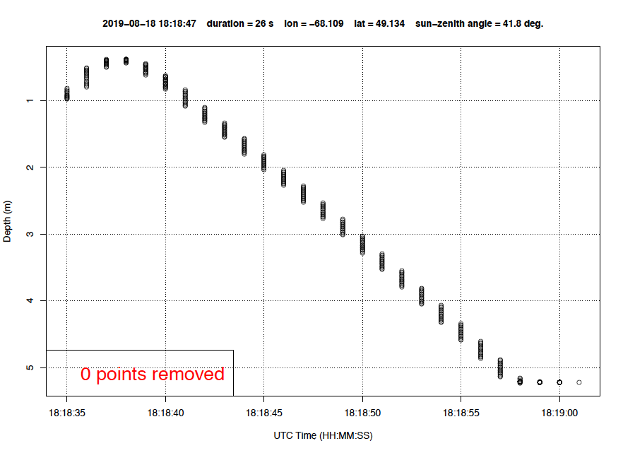

<p class="caption">

Figure 2. Example of pressure or depth of the profiler versus time in
second since the begining of the recording

</p>

</div>

With the version 4.0, you can clean the file by runing the code again,
but with the **CLEAN.FILES** option set to **TRUE**. Note that this step
can be avoid if the data were already cleaned using the Shiny App
developped by Guislain Bécu. This application can be downloaded from
<https://github.com/GuislainBecu/01.COPS.CLEAN.INPUT.FILES>

``` r
cops.go(CLEAN.FILES = TRUE)
```

The user will be prompt to click on plot of depth versus index to
determine the begining of the cast and the end of the cast (Figure
3).

<div class="figure">

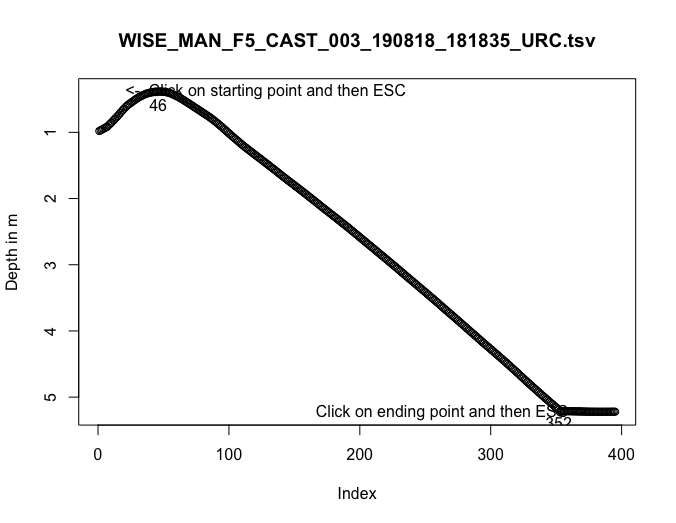

<p class="caption">

Figure 3. Example of depth of the profiler versus the number of records
(index) available in the file

</p>

</div>

Here the user click on the index 46 for the starting point and the index
352 for the ending point. In this example, the profiler hit the bottom,
as the depth become constant to 5.5 m from the index 352 to the end of
the cast. **IMPORTANT NOTE: To avoid bad data near the bottom, the
profile will be cut 15 cm abobe the ending point set by the user.** This
procesing greatly improve the results in shallow waters, allowing easier
extraction of the bottom reflectance property.

Figures 4 and 5 show the depth vs duration and the instrument tilt
during the cast, respectively. Here the tilt of both Ed0 and EdZ
instruments was below the threshold, exept for a few points near the
surface. In difficult conditions, i.e. due to strong current or wind,
too much tension in the cable, the C-OPS tilt may be high. The Figure 6
shows an extreme case we encountered in the Labrador Sea in 2014.
Keeping the tilt threshold at 5 degrees the for the in-water sensors
would have removed nearly all the data\! In such case we need to
increased the threshold to 10 degrees to get AOPs, which acceptable in
the open ocean when the profiler is far from the
ship.

<div class="figure">

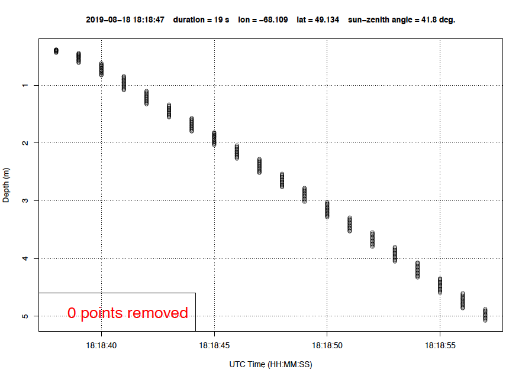

<p class="caption">

Figure 4. Example of pressure or depth of the profiler versus time in
second since the begining of the recording after cleaning the
file.

</p>

</div>

<div class="figure">

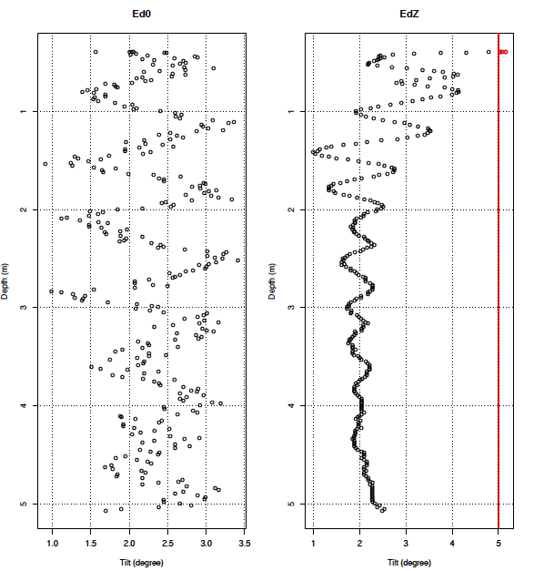

<p class="caption">

Figure 5. Example of instrument tilt for Ed0 and EdZ (i.e. the profiler)
during the cast. Red points have been discarded for the rest of the
analysis using the tiltmax.optics
parameter.

</p>

</div>

<div class="figure">


<p class="caption">

Figure 6. Example of instrument tilt for Ed0 and EdZ (i.e. the profiler)
during the VITALS cruise in 2014 onboard the Hudson. Note that the
figure was generated by the version 3 of the Cops
package.

</p>

</div>

### Step 2.2 : Check the dowelling irradiance conditions during the cast.

Downwelling irradiance above water (Ed0) must be stable during the C-OPS
vertical profile. Cloudy sky can make it highly variable. Some shadow on
the instrument from the ship structure a person near by (on small boat
sometime) can be a problem as well. Big change in Ed0 will likely
results in a bad light profile because LuZ and EdZ are normalized by the
Ed0 variability (see NASA protocols). In the example shown in Figure 7,
Ed0 was very stable. The variability was due to tilt of the instrument
probably resulting from a moving boat by waves. The LOESS smoothing
completely remove these artefacts. In this example, the conditions were
perfect.

<div class="figure">

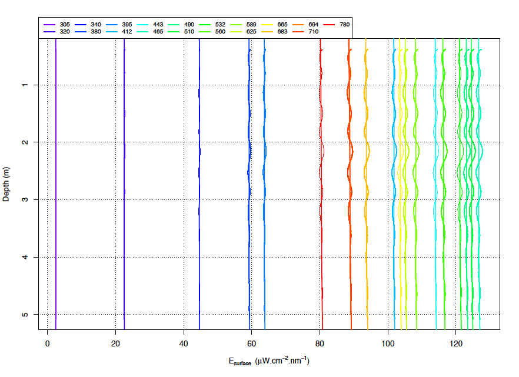

<p class="caption">

Figure 7. Example of stable Ed0 conditions during a vertical profile

</p>

</div>

The next example (Fig. 8) shows a drastic drop in Ed0 during a profile.
This kind of unstable conditions is bad for the rest of the data
processing. This profile should be discarded by changing the value of 1
to 0 in the file
**select.cops.dat**.

<div class="figure">


<p class="caption">

Figure 8. Example of an unstable Ed0 conditions during a vertical
profile

</p>

</div>

### Step 2.3 : Check the quality of the extrapolation of the radiometric quantity to the air-water interface

One of the most important thing to check when processing C-OPS data is
the quality of the extrapolation of the upwelling radiance (LuZ) or
irradiance (EuZ) at the air-water interface. This will determine the
quality the remote sensing reflectance, Rrs, which is one of the most
important apparent optical property (AOP) we want to extract from the
C-OPS data.

In the current `Cops` package version (4.0), there is two methods
implemented to extrapolate to the air-water interface: a non-linear
method call LOESS and a linear fit on the log-transformed radiance or
irradiance profiles. The LOESS is applied to the whole profile, while
the linear fit is limited to a thin layer near the surface. Several
plots are available in the PDF to diagnose the quality of the fit.
**Note that all data points below the instrument detection limit are
eliminated in the fitting process**. This is feature has been
implemented in the version 4.0 of the `Cops`package. One can visualized
the default values implemented in the package by accessing the variable
detection.limit, which is a Global Environment Variable (shown below).
To obtain more information about the instrument detection limit or
update these threshold, the user can refer to the help page of the
function `cops.detection.limit()`.

``` r
detection.limit
```

    ##    waves   EdZ   EuZ   LuZ
    ## 1    305 4e-03 4e-03 5e-05
    ## 2    320 4e-03 4e-03 5e-05
    ## 3    330 4e-03 4e-03 5e-05
    ## 4    340 4e-03 4e-03 5e-05
    ## 5    380 7e-03 7e-03 2e-04
    ## 6    395 8e-04 8e-04 5e-05
    ## 7    412 8e-04 8e-04 5e-05
    ## 8    443 8e-04 8e-04 4e-05
    ## 9    465 8e-04 8e-04 1e-04
    ## 10   490 5e-04 5e-04 2e-05
    ## 11   510 5e-04 5e-04 3e-05
    ## 12   532 5e-04 5e-04 4e-05
    ## 13   555 5e-04 5e-04 4e-05
    ## 14   560 5e-04 5e-04 4e-05
    ## 15   589 5e-04 5e-04 2e-05
    ## 16   625 5e-04 5e-04 1e-05
    ## 17   665 5e-04 5e-04 1e-05
    ## 18   683 5e-04 5e-04 1e-05
    ## 19   694 1e-04 1e-04 1e-05
    ## 20   710 1e-04 1e-04 1e-05
    ## 21   780 2e-04 2e-04 1e-05
    ## 22   875 2e-04 2e-04 2e-05

The following plots allow you to evaluate the quality of the LuZ
extrapolation to the surface (x = 0-). The figure 9 is a zoom on the
surface layer of the water column. It presents all 19 wavelenghts and
the 2 fitting methods on the same plot. Note that no fit was performed
for the 305 nm and 320 nm channels due to the lack of measurements above
the instrument detection limit (here set at 5e-5), which is
wavelength-specific and
sensor-specific.

<div class="figure">


<p class="caption">

Figure 9. Example of LuZ extrapolation to the surface (z=0-) using
non-linear fitting with LOESS method (solid line) and the linear method
(dashed line) described in Bélanger et al (2017). C-OPS measurements are
the small dots while the big solid circles indicate the maximum depth
used to make the linear extrapolation of LuZ to 0- depth.

</p>

</div>

The next plot (Fig. 10) is good to appreciate the overall quality of the
LOESS fit for each 19 wavelenghts. In this optically shallow water
example, the increase in LuZ near the bottom is NOT an artefact. In
these type of environnement, LuZ and EuZ field are highly non-linear. It
is due to the bottom reflectance which reflect a large fraction of the
EdZ that reached the bottom. So the LuZ or EuZ at the bottom is then
being attenuated upward above th bottom. For an insightful discussion,
please refer to Maritorena, Morel, and Gentili (1994).

Overall the fit is pretty good but not perfect. It can be improved by
using a slightly smaller depth windows for the LuZ smoothing. This is
again given by the parameter **depth.interval.for.smoothing.optics**,
which set by default at 4 meters. Figure 11 is the same as Fig. 10 but
for a depth interval set at 3 meters for LuZ. This reduction improve the
fit for some wavelenghts near the bottom (i.e., 465 to 560 nm). Note
that two additional lines appear on these plots. The vertical orange
lines are the detection limits (e.g. for 340 and 380 nm). So every
measurements at the left of them are not considered in the fit. The
green horizontal lines are the threshold specified by the parameter
**sub.surface.removed.layer.optics**, which was set to 0 in this
example.

<div class="figure">

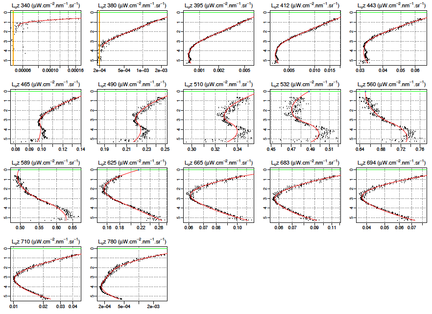

<p class="caption">

Figure 10. Example of LuZ fitted with the LOESS method for each
individual
channels.

</p>

</div>

<div class="figure">

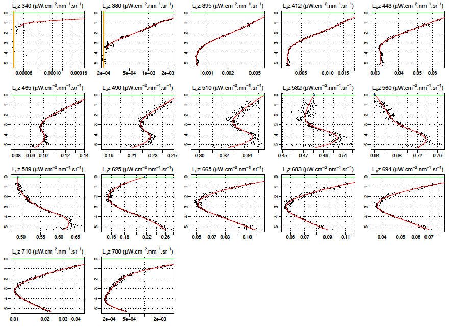

<p class="caption">

Figure 11. Same as 10, but for a depth interval for smoothing reduced at
3 meters

</p>

</div>

To compare the linear versus the LOESS fit near the air-water interface,
two additional plots focusing on the surface are available in the PDF.
Figure 12 is similar to Figures 10 and 11, but for the surface. The red
curves are the LOESS fit while the blue lines are the linear fits.
**Note the absence of linear fit at 532 nm**. This is due to a low
R-squared value of the fit, as shown at the top of each plot. In the
`Cops` package version 4.0, a threshold of 0.6 is hard-coded for LuZ and
EuZ for the R-squared value. In other words, the linear fit is
considered to fail if the R-squared value is below 0.6. So here the
R-squared value at 532 was set to NA because it was below 0.6. This
profile looks particularly noisy near the surface due to clear sky
condition and wave focussing effect (Zaneveld, Boss, and Barnard 2001).

Figure 13 is similar to Fig 12, but for four selected wavelengths to
better appreciate the fitting methods comparison.

Overall, for this profile, we would consider the LOESS fit more
appropriate because of the strong non-linearity of the light profile.
For further data exploitation, we will edit the **select.cops.dat** to
indicate the use of the LOESS for the remote sensing refletance
as:

WISE\_MAN\_F5\_CAST\_003\_190818\_181835\_URC.tsv;1;**Rrs.0p**;NA

<div class="figure">

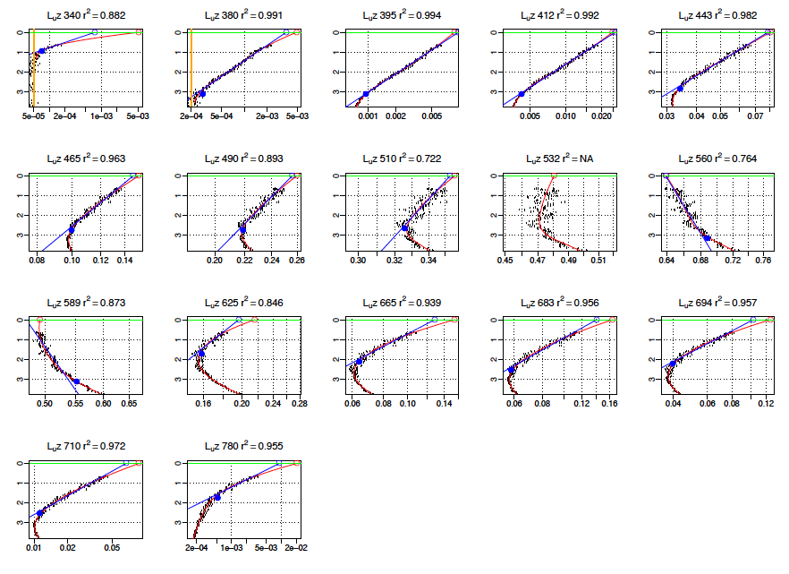

<p class="caption">

Figure 12. Same as 11, but for the surface
layer.

</p>

</div>

<div class="figure">

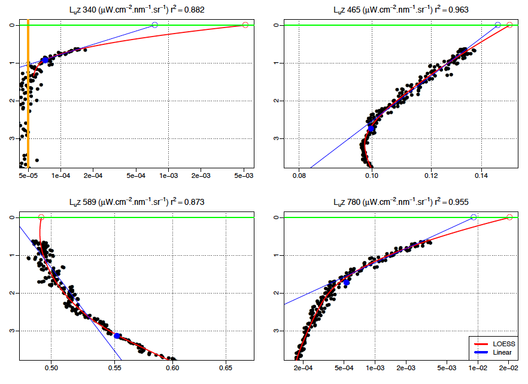

<p class="caption">

Figure 13. Same as 12, but for selected wavelenghts across the spectrum.

</p>

</div>

### Step 2.4 : Quality check of the EdZ fit

As for LuZ or EuZ, we check whether the LOESS parameters need adjustment
to fit the measurements of EdZ. As shown in figures 14 and 15, the
default **depth.interval.for.smoothing.optics** of 4 meters works well
for our profile, except at 305 and 320 nm where a strange behavior of
the LOESS fit is observed. This is often observed when a small number of
valid observations are available near the surface. In addition, we can
see that the EdZ are even more noisy compare to LuZ due to wave focusing
effect, as expected under clear sky and wavy surface (Zaneveld, Boss,
and Barnard 2001). One way to remove this noise is to use the parameter
**sub.surface.removed.layer.optics**, which was set to 0.1 meter in this
example. Befor adjusting this parameters, we need to make sure the
surface waters are optically homogenous, which is not the case in our
example. We can observed a change in the slope at around 1.5 meters,
which particulary evidentin the UV wavelenghts (340, 380, 395 nm). This
suggest the presence of a CDOM-rich surface layer of a 1.5 meters depth.
So to keep this feature, we could have increased the
**sub.surface.removed.layer.optics** to 0.5 meter and decreased the
**depth.interval.for.smoothing.optics** to 3 meters, but here these
changes did not improved the results significantly (not shown). As for
LuZ, other plots focusing on the surface layer can be used to compare
the LOESS with the linear extrapolation are available (Fig.
17).

<div class="figure">

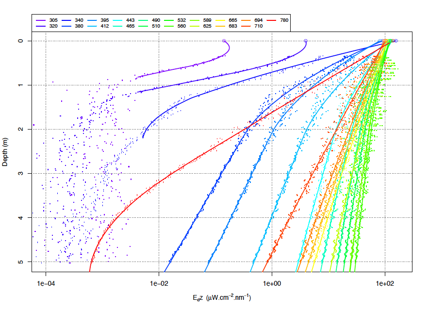

<p class="caption">

Figure 14. Example of EdZ fit with the LOESS using a depth interval of 4
meters.

</p>

</div>

<div class="figure">

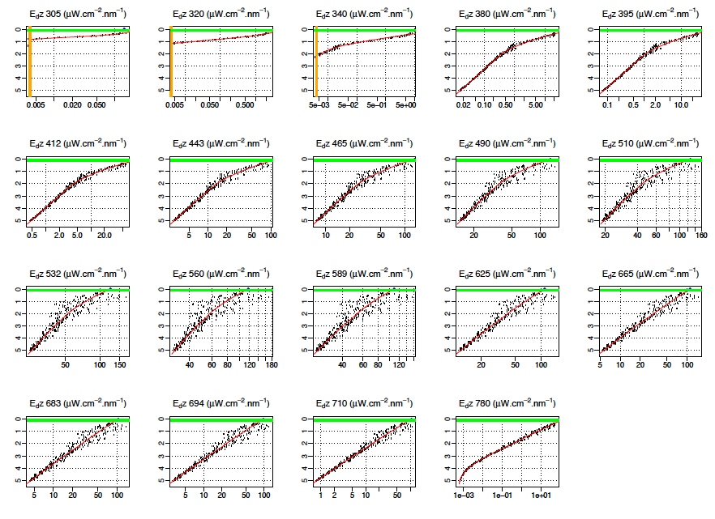

<p class="caption">

Figure 15. Example of EdZ fit with the LOESS using a depth interval of 4
meters for each
wavelength.

</p>

</div>

<div class="figure">

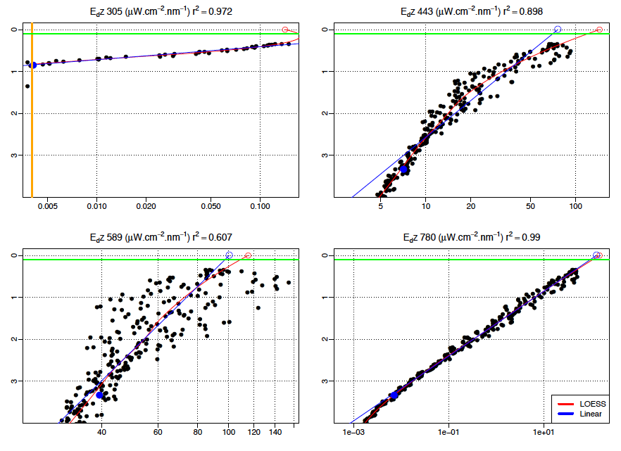

<p class="caption">

Figure 16. Example of EdZ fit with the LOESS and linear at the surface
for 4 selected wavelenghts.

</p>

</div>

Figure 17 shows two extra plots to assess the quality of the EdZ
extrapolation to the air-water interface. Here the extrapolated values
of Ed at 0- are compared to the irradiance spectrum measured in the air
by the reference sensor, multiply by a factor of 0.957 to account for
the specular reflexion at the interface. In this example, the LOESS
extrapolation tend to overestimate Ed0- (by about 20% in the visible),
while the linear extrapolation underestimate Ed0- in the UV/blue and
overestimate in the NIR. These results can be explained when examining
in more details Figure 16 that compares the extrapolation methods at
selected wavelenghts. This example demonstrate the difficulty to
extrapolate EdZ to 0- under clear sky and vertically inhomogenous water
column. This is the reason why multiple C-OPS cast are required in such
conditions to end up with good
AOPs.

<div class="figure">

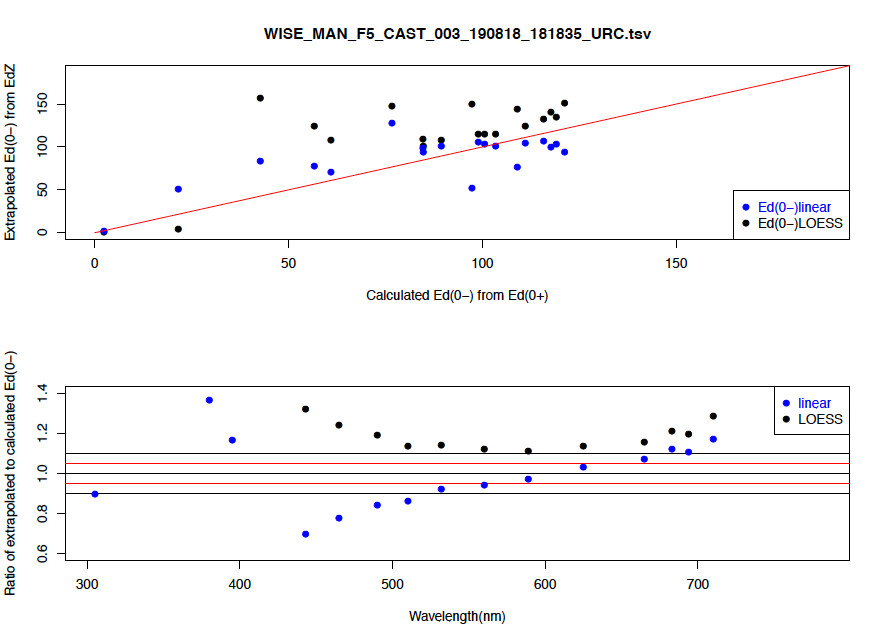

<p class="caption">

Figure 17. Top: relationship between extrapolated irradiance at 0- and
the estimated irradiance based on the reference, Ed0\*0.957. Bottom: the
ratio of extrapolated to estimated Ed at 0- from EdZ and Ed0
respectively.

</p>

</div>

### Step 3 : Compare replicates

Once each profile was processed with appropriate values for the
**tiltmax.optics**, **depth.interval.for.smoothing.optics** and
**sub.surface.removed.layer.optics** fields, then we compare all the
C-OPS profiles of a given station (remember that we have **one folder
per station\!\!\!**).

Two plots are generated for Rrs and Kd (from the surface layer) with
every file set to 1 in the file **select.cops.dat**. These plots are
generated by the function `plot.Rrs.Kd.for.station()` after the
processing of all cast to process found in each directory. The solid
lines are for the LOESS method, while the dashed lines is for the linear
extrapolation method.

For both Kd and Rrs, the difference between the casts are quite
significant (Figs. 18 and 19). The variability in Rrs observed at
station MAN-F05 presented here is mainly due to the water depth. In
fact, the actual depth of the cast 1, 2, 3 and 4 was 6.37, 5.48, 5.08
and 7.5 m. The differenc in depth is consistent with the Rrs values,
with higher green reflectance for shallower profiles. The cast number 4,
however, is clearly an outlier in terms of Kd (higher values across the
spectrum). It is also lower in term of Rrs (deeper waters). This cast
should be discarded for the data
base.

<div class="figure">

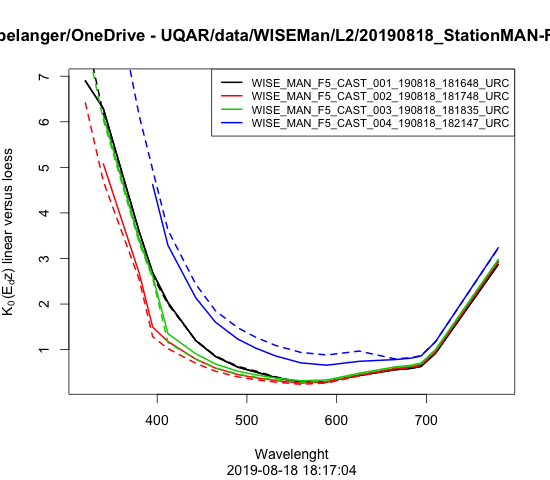

<p class="caption">

Figure 18. Example of 4 replicates for Kd for the WISE-Man station
MAN-F05 visited on 18th
Aug. 2019.

</p>

</div>

<div class="figure">

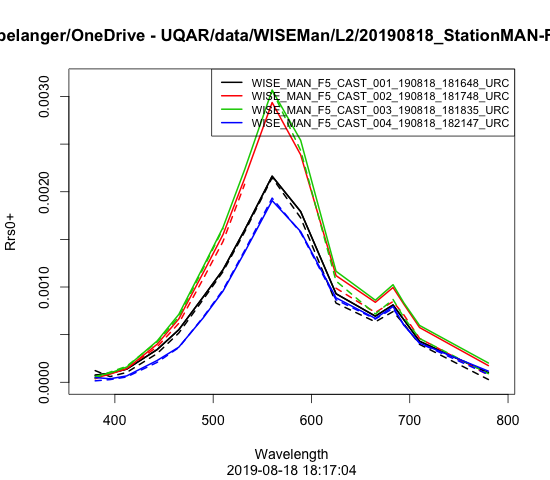

<p class="caption">

Figure 19. Same as 18, but for the remote sensing reflectance.

</p>

</div>

In general, there are always more differences in Rrs due to the
extrapolation method. In this example, the linear extrapolation yield
slightly lower Rrs values at all wavelengths. This is often the case in
very absorbing waters as the one observed here.

For this station we should eliminate the cast number 4 and use the LOESS
exprapolation for Rrs to avoid missing values.

### Step 4: Remove outlier and document the data processing

In the above example, the cast number 4 must be remove for further data
processing. Again, we do that by editing the file **select.cops.dat**
such as:

**WISE\_MAN\_F5\_CAST\_001\_190818\_181648\_URC.tsv;1;Rrs.0p;NA**

**WISE\_MAN\_F5\_CAST\_002\_190818\_181748\_URC.tsv;1;Rrs.0p;NA**

**WISE\_MAN\_F5\_CAST\_003\_190818\_181835\_URC.tsv;1;Rrs.0p;NA**

**WISE\_MAN\_F5\_CAST\_004\_190818\_182147\_URC.tsv;0;Rrs.0p;NA**

You can also check again the comments logged by the operators on the
field. It usually helps to identify the casts that may be better than
the others.

It is also important to document the data processing in a log file. I
usualy fill an EXCEL file with the following columns: COPS File name;
Station; kept; Processing comments. In the later column I would explain
why I did not kept the profile (here the Kd near the surface was very
different than the other cast). A note should be taken about the Rrs
variability, which can be explain by significant variability in terms of
water depth.

### Step 5 : Instrument self-shading correction

To complete the data processing, you should consider to correct for the
instrument self-shading. This is done by choosing one of the
**shadow.correction** method (field number 4 in the **info.cops.dat**
file) to use for calculating the water-leaving radiance and the
reflectance. As most of our work are in coastal or in-land or Arctic
waters, I strongly recommand to set the *shadow.correction* to 0 and
provide the total absorption coefficients for all wavelengths in the
**absorption.cops.dat** file. The default value is 999, which uses
estimations of sub-surface irradiance reflectacce (R) and diffuse
attenuation (Kd) to estimate the total absorption (Morel and Maritorena
2001). Exceptionnaly, if you don’t have absorption measurement and you
work in oceanic water, you can provided the chlorophyll-a concentration
and the Case-1 water bio-optical model of Morel and Maritorena (2001)
will be employed.

Absorption coefficients can be measured using in-water instruments, such
as AC-s or a-sphere, or from discrete samples for CDOM and particulate
matter using filter pad thecnique. If in-water coefficients are
available, it will be relatively strait forward to edit the
**absorption.cops.dat** file using `compute.aTOT.for.COPS()` function
from the `Riops` package.

If only discrete samples is available, the **absorption.cops.dat** file
may be edited using `compute.discrete.aTOT.for.COPS()` function from the
`RspectroAbs` package.

The importance of this correction can be visualised in the PDF document
in the page showing the various water-leaving radiances and reflectances
spectra. The Figure 20 shows a typical Case-2 water case. The correction
is relatively important in the NIR and UV
bands.

<div class="figure">

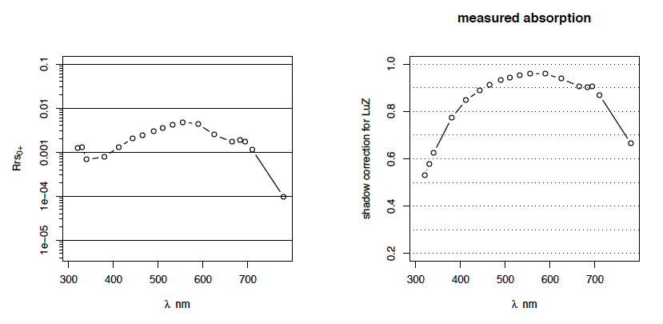

<p class="caption">

Figure 20. Example of Rrs and shadow correction coefficient

</p>

</div>

### Step 6 : Generate the data base

Once you have processed all stations individually and discarded the
casts you consider of lower quality, then you can easily generate a
database. You have to create an ASCII file named
**directories.for.cops.dat** in the parent folder of the stations
folder, i.e. for example

**/data/ProjetX/L2/**

and put all the station paths you want to include in the data base. Next
you can run the `generate.cops.DB()`. This function compute mean and
standard deviation of selected parameters using the profiles that passed
the QC (as found in **select.cops.dat** file). The folowing parameters
are computed :

  - *Kd1p*: is the mean spectral diffuse attenuation from the surface to
    the 1% light level for each wavelength (2 matrices for mean and
    s.d.)  
  - *Kd10p*: is the mean spectral diffuse attenuation from the surface
    to the 10% light level for each wavelength (2 matrices for mean and
    s.d.)
  - *Rrs*: is the mean spectral Remote sensing reflectance (2 matrices
    for mean and s.d.)
  - *Ed0.0p*: is the mean spectral incident irradiance at surface (2
    matrices for mean and s.d.)
  - *Ed0.f*: is the modeled or measured (with Bioshade) fraction of
    diffuse skylight to the total downwelling irradiance (matrix)
  - *Ed0.f.measured*: is a flag indicating whether *Ed0.f* was measured
    using the BioShade (=1) or modelled using the Gregg and Carder
    (1990) model (=0)
  - *date*: is a vector of date in POSIXCT format
  - *lat*: is a vector of latitude
  - *lon*: is a vector of longitude
  - *sunzen*: is a vector of solar zenith angle
  - *waves*: is a vector of wavelenghts

The object COPS.DB is saved in RData format. The data are also saved in
ASCII (.dat with comma separator) and a figure showing the measured Rrs
spectra of the data base is produced.

``` r
COPS.DB <- generate.cops.DB(path="/data/ProjetX/L2/", 
                            waves.DB = c(412,443,490,555), 
                            mission = "MISSION_IMPOSSIBLE")
```

Note here that the user can select the actual wavelengths to include in
the database. In the example above only 4 channels were selected. The
default wavelenths are: 320, 330, 340, 380, 412, 443, 465, 490, 510,
532, 555, 589, 625, 665, 683, 694, 710, 780, 865 nm.

## Data format

The /BIN folders contain the binary data stored in the RData format.
These files contain list of variables named *cops*. All the information
for a given cast, including the raw data, is stored in this data
structure (i.e. an R `list`). This is very easy in R to deal with this
type of data. The example below contains as much as 112 variables,
including processing parameters, raw data, fitted data and so
on.

``` r
load("~/OneDrive - UQAR/data/WISEMan/L2/20190818_StationMAN-F05/COPS_BU/BIN/WISE_MAN_F5_CAST_003_190818_181835_URC.tsv.RData")
str(cops)
```

    ## List of 112
    ##  $ verbose                            : logi TRUE
    ##  $ indice.water                       : num 1.34
    ##  $ rau.Fresnel                        : num 0.043
    ##  $ win.width                          : num 9
    ##  $ win.height                         : num 7
    ##  $ instruments.optics                 : chr [1:3] "Ed0" "EdZ" "LuZ"
    ##  $ tiltmax.optics                     : Named num [1:3] 10 5 5
    ##   ..- attr(*, "names")= chr [1:3] "Ed0" "EdZ" "LuZ"
    ##  $ depth.interval.for.smoothing.optics: Named num [1:3] 10 3 3
    ##   ..- attr(*, "names")= chr [1:3] "Ed0" "EdZ" "LuZ"
    ##  $ sub.surface.removed.layer.optics   : Named num [1:3] 0 0.3 0
    ##   ..- attr(*, "names")= chr [1:3] "Ed0" "EdZ" "LuZ"
    ##  $ delta.capteur.optics               : Named num [1:3] 0 -0.05 0.238
    ##   ..- attr(*, "names")= chr [1:3] "Ed0" "EdZ" "LuZ"
    ##  $ radius.instrument.optics           : Named num [1:3] 0.035 0.035 0.035
    ##   ..- attr(*, "names")= chr [1:3] "Ed0" "EdZ" "LuZ"
    ##  $ format.date                        : chr "%m/%d/%Y %H:%M:%S"
    ##  $ instruments.others                 : chr "NA"
    ##  $ depth.is.on                        : chr "LuZ"
    ##  $ number.of.fields.before.date       : num 5
    ##  $ time.window                        : num [1:2] 0 10000
    ##  $ depth.discretization               : num [1:19] 0 0.01 1 0.02 2 0.05 5 0.1 10 0.2 ...
    ##  $ file                               : chr "WISE_MAN_F5_CAST_003_190818_181835_URC.tsv"
    ##  $ chl                                : num 999
    ##  $ EXTRAPOLATION.0m                   : logi TRUE
    ##  $ SHADOW.CORRECTION                  : logi TRUE
    ##  $ absorption.waves                   : logi NA
    ##  $ absorption.values                  : Named num [1:19] NA NA NA 2.26 1.8 ...
    ##   ..- attr(*, "names")= chr [1:19] "305" "320" "340" "380" ...
    ##  $ blacks                             : chr(0) 
    ##  $ Ed0                                : num [1:297, 1:19] 2.44 2.44 2.44 2.44 2.44 ...
    ##   ..- attr(*, "dimnames")=List of 2
    ##   .. ..$ : NULL
    ##   .. ..$ : chr [1:19] "305" "320" "340" "380" ...
    ##  $ EdZ                                : num [1:297, 1:19] 0.173 0.171 0.164 0.15 0.136 ...
    ##   ..- attr(*, "dimnames")=List of 2
    ##   .. ..$ : NULL
    ##   .. ..$ : chr [1:19] "305" "320" "340" "380" ...
    ##  $ LuZ                                : num [1:297, 1:19] 1.92e-05 2.68e-05 1.09e-05 1.20e-05 1.55e-05 ...
    ##   ..- attr(*, "dimnames")=List of 2
    ##   .. ..$ : NULL
    ##   .. ..$ : chr [1:19] "305" "320" "340" "380" ...
    ##  $ Ed0.anc                            :'data.frame': 297 obs. of  3 variables:
    ##   ..$ Roll : num [1:297] -0.979 -0.559 -0.28 -0.629 -0.629 ...
    ##   ..$ Pitch: num [1:297] 1.75 1.96 1.54 1.96 2.38 ...
    ##   ..$ Tilt : num [1:297] -2 -2.04 -1.56 -2.06 -2.46 ...
    ##  $ EdZ.anc                            :'data.frame': 297 obs. of  3 variables:
    ##   ..$ Roll : num [1:297] 1.19 1.61 1.96 2.31 2.52 ...
    ##   ..$ Pitch: num [1:297] 4.9 4.9 4.69 4.2 3.5 ...
    ##   ..$ Tilt : num [1:297] 5.04 5.15 5.08 4.79 4.3 ...
    ##  $ LuZ.anc                            :'data.frame': 297 obs. of  2 variables:
    ##   ..$ Depth: num [1:297] 0.385 0.387 0.39 0.392 0.397 ...
    ##   ..$ Temp : num [1:297] 9.42 9.37 9.3 9.25 9.2 ...
    ##  $ Ed0.waves                          : num [1:19] 305 320 340 380 395 412 443 465 490 510 ...
    ##  $ EdZ.waves                          : num [1:19] 305 320 340 380 395 412 443 465 490 510 ...
    ##  $ LuZ.waves                          : num [1:19] 305 320 340 380 395 412 443 465 490 510 ...
    ##  $ Others                             :'data.frame': 297 obs. of  7 variables:
    ##   ..$ GeneralExcelTime : num [1:297] 43696 43696 43696 43696 43696 ...
    ##   ..$ DateTime         : chr [1:297] "8/18/2019 6:18:38 PM" "8/18/2019 6:18:38 PM" "8/18/2019 6:18:38 PM" "8/18/2019 6:18:38 PM" ...
    ##   ..$ DateTimeUTC      : chr [1:297] "08/18/2019 06:18:38.37 PM" "08/18/2019 06:18:38.433 PM" "08/18/2019 06:18:38.495 PM" "08/18/2019 06:18:38.558 PM" ...
    ##   ..$ Millisecond      : int [1:297] 370 433 495 558 636 698 760 823 901 963 ...
    ##   ..$ BioGPSPosition   : num [1:297] -6807 4908 10 -998 -6807 ...
    ##   ..$ SolarZenithAngle : int [1:297] -999 -999 -999 -999 -999 -999 -999 -999 -999 -999 ...
    ##   ..$ SolarAzimuthAngle: int [1:297] -999 -999 -999 -999 -999 -999 -999 -999 -999 -999 ...
    ##  $ file                               : chr "WISE_MAN_F5_CAST_003_190818_181835_URC.tsv"
    ##  $ potential.gps.file                 : chr "GPS_190818.tsv"
    ##  $ Ed0.tilt                           : num [1:297] 2 2.04 1.56 2.06 2.46 ...
    ##  $ EdZ.tilt                           : num [1:297] 5.04 5.15 5.08 4.79 4.3 ...
    ##  $ LuZ.tilt                           : NULL
    ##  $ change.position                    : logi FALSE
    ##  $ longitude                          : num -68.1
    ##  $ latitude                           : num 49.1
    ##  $ dates                              : POSIXct[1:297], format: "2019-08-18 18:18:38" "2019-08-18 18:18:38" ...
    ##  $ date.mean                          : POSIXct[1:1], format: "2019-08-18 18:18:47"
    ##  $ cops.duration.secs                 : num 19
    ##  $ day                                : num 18
    ##  $ month                              : num 8
    ##  $ year                               : num 2019
    ##  $ sunzen                             : num 41.8
    ##  $ Depth                              : num [1:297] 0.385 0.387 0.39 0.392 0.397 ...
    ##  $ Depth.good                         : logi [1:297] TRUE TRUE TRUE TRUE TRUE TRUE ...
    ##  $ depth.fitted                       : num [1:214] 0 0.01 0.02 0.03 0.04 0.05 0.06 0.07 0.08 0.09 ...
    ##  $ Ed0.th                             : num [1:19] NA 29.5 45.8 62 63.4 ...
    ##  $ Ed0.0p                             : num [1:19] 2.43 22.54 44.6 59.19 63.69 ...
    ##  $ Ed0.fitted                         : num [1:214, 1:19] 2.43 2.43 2.43 2.43 2.43 ...
    ##   ..- attr(*, "dimnames")=List of 2
    ##   .. ..$ : chr [1:214] "0" "0.01" "0.02" "0.03" ...
    ##   .. ..$ : chr [1:19] "305" "320" "340" "380" ...
    ##  $ Ed0.correction                     : num [1:297, 1:19] 0.997 0.997 0.998 0.998 0.998 ...
    ##   ..- attr(*, "dimnames")=List of 2
    ##   .. ..$ : NULL
    ##   .. ..$ : chr [1:19] "305" "320" "340" "380" ...
    ##  $ LuZ.fitted                         : num [1:214, 1:19] NA NA NA NA NA NA NA NA NA NA ...
    ##   ..- attr(*, "dimnames")=List of 2
    ##   .. ..$ : chr [1:214] "0" "0.01" "0.02" "0.03" ...
    ##   .. ..$ : chr [1:19] "305" "320" "340" "380" ...
    ##  $ KZ.LuZ.fitted                      : num [1:213, 1:19] NA NA NA NA NA NA NA NA NA NA ...
    ##   ..- attr(*, "dimnames")=List of 2
    ##   .. ..$ : chr [1:213] "0.01" "0.02" "0.03" "0.04" ...
    ##   .. ..$ : chr [1:19] "305" "320" "340" "380" ...
    ##  $ K0.LuZ.fitted                      : num [1:213, 1:19] NA NA NA NA NA NA NA NA NA NA ...
    ##   ..- attr(*, "dimnames")=List of 2
    ##   .. ..$ : chr [1:213] "0.01" "0.02" "0.03" "0.04" ...
    ##   .. ..$ : chr [1:19] "305" "320" "340" "380" ...
    ##  $ LuZ.0m                             : num [1:19] NA NA 0.00517 0.00487 0.00883 ...
    ##  $ K.LuZ.surf                         : num [1:19] NA NA 2.589 0.881 0.752 ...
    ##  $ LuZ.Z.interval                     : num [1:19] NA NA 0.93 3.13 3.13 ...
    ##  $ LuZ.ix.Z.interval                  : int [1:19] NA NA 28 168 168 168 150 143 143 137 ...
    ##  $ LuZ.0m.linear                      : num [1:19] NA NA 0.000747 0.003542 0.009707 ...
    ##  $ LuZ.linear.r2                      : num [1:19] NA NA 0.882 0.991 0.994 ...
    ##  $ LuZ.KolmolSmirnov.p.value          : num [1:19] NA NA 0.994 0.969 0.969 ...
    ##  $ LuZ.detection.limit                : num [1:19] 5e-05 5e-05 5e-05 2e-04 5e-05 5e-05 4e-05 1e-04 2e-05 3e-05 ...
    ##  $ EdZ.fitted                         : num [1:214, 1:19] 0.142 0.146 0.149 0.153 0.156 ...
    ##   ..- attr(*, "dimnames")=List of 2
    ##   .. ..$ : chr [1:214] "0" "0.01" "0.02" "0.03" ...
    ##   .. ..$ : chr [1:19] "305" "320" "340" "380" ...
    ##  $ KZ.EdZ.fitted                      : num [1:213, 1:19] -2.68 -2.51 -2.34 -2.16 -1.99 ...
    ##   ..- attr(*, "dimnames")=List of 2
    ##   .. ..$ : chr [1:213] "0.01" "0.02" "0.03" "0.04" ...
    ##   .. ..$ : chr [1:19] "305" "320" "340" "380" ...
    ##  $ K0.EdZ.fitted                      : num [1:213, 1:19] -2.68 -2.6 -2.51 -2.42 -2.34 ...
    ##   ..- attr(*, "dimnames")=List of 2
    ##   .. ..$ : chr [1:213] "0.01" "0.02" "0.03" "0.04" ...
    ##   .. ..$ : chr [1:19] "305" "320" "340" "380" ...
    ##  $ EdZ.0m                             : num [1:19] 0.142 3.966 157.115 124.726 108.16 ...
    ##  $ K.EdZ.surf                         : num [1:19] 7.43 7.85 6.05 3.34 2.56 ...
    ##  $ EdZ.Z.interval                     : num [1:19] 0.842 1.242 1.442 1.442 1.542 ...
    ##  $ EdZ.ix.Z.interval                  : int [1:19] 42 66 79 79 86 198 198 198 198 198 ...
    ##  $ EdZ.0m.linear                      : num [1:19] 2.09 50.68 83.87 77.3 71.02 ...
    ##  $ EdZ.linear.r2                      : num [1:19] 0.972 0.984 0.989 0.967 0.954 ...
    ##  $ EdZ.KolmolSmirnov.p.value          : num [1:19] 0.988 0.925 0.916 0.916 0.935 ...
    ##  $ EdZ.detection.limit                : num [1:19] 4e-03 4e-03 4e-03 7e-03 8e-04 8e-04 8e-04 8e-04 5e-04 5e-04 ...
    ##  $ PARd.z                             : num [1:214] 1797 1776 1755 1735 1715 ...
    ##  $ PARd.at.z                          :'data.frame': 5 obs. of  2 variables:
    ##   ..$ z.fixed: num [1:5] 5 10 20 30 40
    ##   ..$ %PAR   : num [1:5] 10.31 1.77 -78.72 -481.57 -1492.11
    ##  $ Q.0                                : num [1:19] 3.14 3.14 3.14 3.14 3.14 ...
    ##  $ Q.sun.nadir                        : num [1:19] 3.14 3.14 3.14 3.14 3.14 ...
    ##  $ f.0                                : num [1:19] 0.33 0.33 0.33 0.33 0.33 0.33 0.33 0.33 0.33 0.33 ...
    ##  $ f.sun                              : num [1:19] 0.33 0.33 0.33 0.33 0.33 0.33 0.33 0.33 0.33 0.33 ...
    ##  $ PAR.0.fitted                       : num [1:214(1d)] 1528 1528 1528 1528 1528 ...
    ##   ..- attr(*, "dimnames")=List of 1
    ##   .. ..$ : chr [1:214] "0" "0.01" "0.02" "0.03" ...
    ##  $ PAR.d.fitted                       : num [1:214(1d)] 1744 1725 1707 1690 1672 ...
    ##   ..- attr(*, "dimnames")=List of 1
    ##   .. ..$ : chr [1:214] "0" "0.01" "0.02" "0.03" ...
    ##  $ LuZ.shad.aR                        : Named num [1:19] NA NA NA 0.0791 0.0629 ...
    ##   ..- attr(*, "names")= chr [1:19] "305" "320" "340" "380" ...
    ##  $ LuZ.shad.Edif                      : num [1:19] NA 0.219 0.279 0.288 0.274 ...
    ##  $ LuZ.shad.Edir                      : num [1:19] NA 0.11 0.199 0.326 0.35 ...
    ##  $ LuZ.shad.ratio.edsky.edsun         : num [1:19] NA 1.987 1.402 0.882 0.783 ...
    ##  $ LuZ.shad.eps.sun                   : Named num [1:19] NA NA NA 0.27 0.222 ...
    ##   ..- attr(*, "names")= chr [1:19] "305" "320" "340" "380" ...
    ##  $ LuZ.shad.eps.sky                   : Named num [1:19] NA NA NA 0.306 0.252 ...
    ##   ..- attr(*, "names")= chr [1:19] "305" "320" "340" "380" ...
    ##  $ LuZ.shad.eps                       : Named num [1:19] NA NA NA 0.287 0.235 ...
    ##   ..- attr(*, "names")= chr [1:19] "305" "320" "340" "380" ...
    ##  $ LuZ.shad.correction                : Named num [1:19] NA NA NA 0.713 0.765 ...
    ##   ..- attr(*, "names")= chr [1:19] "305" "320" "340" "380" ...
    ##  $ absorption.values                  : Named num [1:19] NA NA NA 2.26 1.8 ...
    ##   ..- attr(*, "names")= chr [1:19] "305" "320" "340" "380" ...
    ##  $ absorption.waves                   : num [1:19] 305 320 340 380 395 412 443 465 490 510 ...
    ##  $ SHADOW.CORRECTION.FROM.KD          : chr "LOESS"
    ##  $ Lw.0p                              : Named num [1:19] NA NA NA 0.00364 0.00615 ...
    ##   ..- attr(*, "names")= chr [1:19] "305" "320" "340" "380" ...
    ##  $ nLw.0p                             : Named num [1:19] NA NA NA 0.00731 0.01122 ...
    ##   ..- attr(*, "names")= chr [1:19] "305" "320" "340" "380" ...
    ##   [list output truncated]

## Bioshade processing

C-OPS system can include a so called **Bioshade**. Bioshade allows the
estimation the fraction of diffuse skylight to the total downwelling
irradiance, as explain in Bélanger et al. (2017). The BioSHADE system is
fitted to the reference Ed0 radiometer. Briefly, the BioSHADE is a motor
that moves a black aluminum band (shadowband) 1.5 mm thick and 2.5 cm
wide back and forth above the Ed0 sensor. Under clear sky conditions,
when the shadowband completely blocks direct sun at time t\_shadow}, the
radiometer measures the diffuse skylight (minus a part of the sky that
is also blocked by the shadowband), Ed0\_diff. When the shadowband is
horizontal, the sensor measures the global solar irradiance. So to
assess the global solar irradiance at the time t\_shadow, we interpolate
Ed0 just before and after the shadowband started to shade the sensor.
This allows to approximate the fraction of diffuse skylight to the total
downwelling irradiance as :

*f = Ed0\_diff/Ed0+*

Because part of the sky is also blocked by the shadowband at t\_shadow,
f will be slightly underestimated. This underestimation will have
negligible impact on the calculations of the shading error when the sun
zenith angle is around 35 degrees, which is close to most conditions
encountered.

To activate the Bioshade processing, we have to edit **select.cops.dat**
file and change the integer to 2. For example:

IML4\_150630\_1339\_C\_data\_005.csv;**2**;Rrs.0p.linear;NA

As for the other files, the *time.window* field must be edited in the
**info.cops.dat** but the other parameters will be ignored during the
processing. Here is an example of the PDF file produced by a bioshade
processing. The figure 21 shows that the BioShade was activated during
the recovering of the profiler. In fact, the profiler was at 30 meters
depth when the acquisition was
started.

<div class="figure">


<p class="caption">

Figure 21. Example of depth versus time for a BioShade measurements

</p>

</div>

The figure 22 shows the Bioshade position as a function of time, which a
relative unit. The shadowband is horizontal, i.e. not shading the
sensor, when it is \<5000 or \>25000. So here the shadowband a
round-trip, passing twice above the sensor. The red points will be used
to interpolate Ed0 just before and after the shadowband started to shade
the
sensor.

<div class="figure">

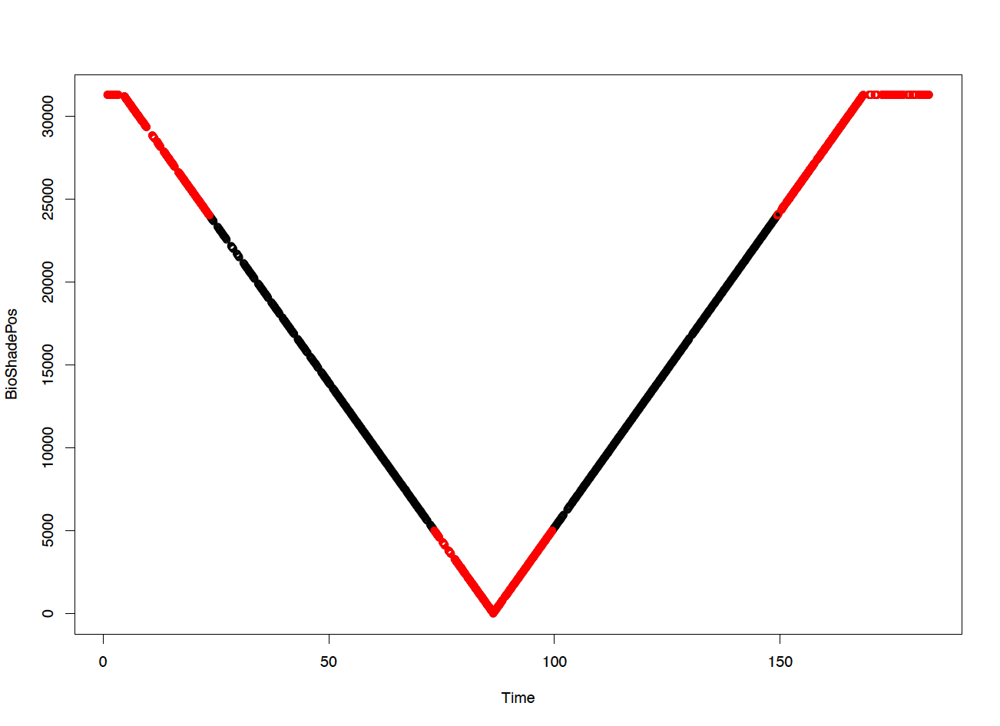

<p class="caption">

Figure 22. Example of Bioshade position versus time

</p>

</div>

The figure 23 shows the Ed0 as a function of time. The solid lines are
the interpolated data use to assess the global irradiance when the
shadowband passed in front the sun, which occured at about 68 and 110
seconds atfer the begining of the data
acquisition.

<div class="figure">

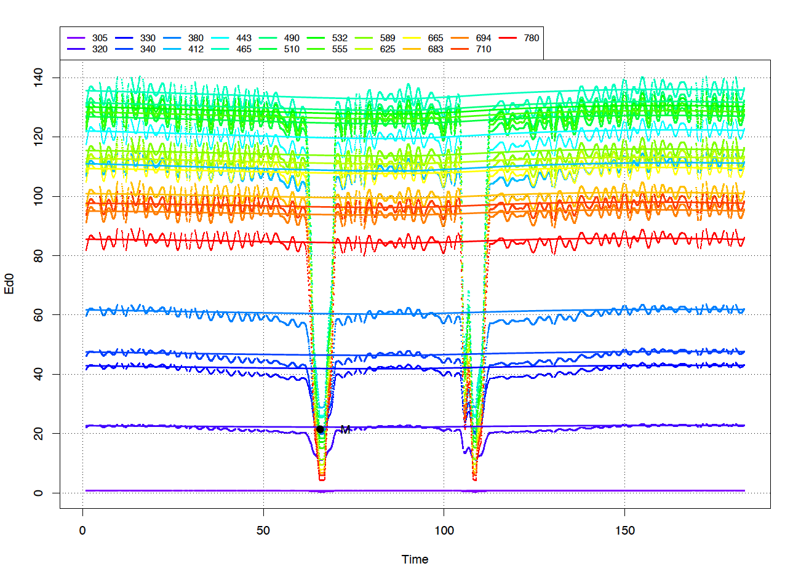

<p class="caption">

Figure 23. Example of downwelling irradiance measured during a Bioshade
measurement

</p>

</div>

In this example is was a clear sky. The fraction of diffuse skylight to
the total downwelling irradiance (green curve) increases exponentially
from the NIR (\<10%) to the UV (~50%) (Fig.
24).

<div class="figure">

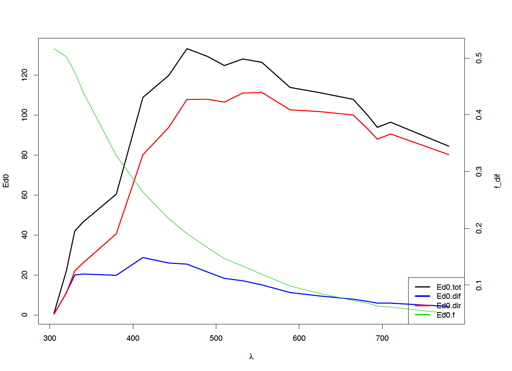

<p class="caption">

Figure 24. Example of total (black), direct (red) and diffuse (blue)
downwelling irradiance assessed using the Bioshade measurements

</p>

</div>

The RData structure saved for a Bioshade file is shown below.

``` r
load("./extdata/IML4_150630_1339_C_data_005.csv.RData")
str(cops)
```

    ## List of 56
    ##  $ verbose                           : logi TRUE
    ##  $ indice.water                      : num 1.34
    ##  $ rau.Fresnel                       : num 0.043
    ##  $ win.width                         : num 9
    ##  $ win.height                        : num 7
    ##  $ instruments.optics                : chr [1:3] "Ed0" "EdZ" "LuZ"
    ##  $ tiltmax.optics                    : Named num [1:3] 5 5 5
    ##   ..- attr(*, "names")= chr [1:3] "Ed0" "EdZ" "LuZ"
    ##  $ time.interval.for.smoothing.optics: Named num [1:3] 40 80 80
    ##   ..- attr(*, "names")= chr [1:3] "Ed0" "EdZ" "LuZ"
    ##  $ sub.surface.removed.layer.optics  : Named num [1:3] 0 0 0
    ##   ..- attr(*, "names")= chr [1:3] "Ed0" "EdZ" "LuZ"
    ##  $ delta.capteur.optics              : Named num [1:3] 0 -0.09 0.25
    ##   ..- attr(*, "names")= chr [1:3] "Ed0" "EdZ" "LuZ"
    ##  $ radius.instrument.optics          : Named num [1:3] 0.035 0.035 0.035
    ##   ..- attr(*, "names")= chr [1:3] "Ed0" "EdZ" "LuZ"
    ##  $ format.date                       : chr "%m/%d/%Y %H:%M:%S"
    ##  $ instruments.others                : chr "NA"
    ##  $ depth.is.on                       : chr "LuZ"
    ##  $ number.of.fields.before.date      : num 1
    ##  $ time.window                       : num [1:2] 0 10000
    ##  $ depth.discretization              : num [1:19] 0 0.01 1 0.02 2 0.05 5 0.1 10 0.2 ...
    ##  $ file                              : chr "IML4_150630_1339_C_data_005.csv"
    ##  $ chl                               : logi NA
    ##  $ SHADOW.CORRECTION                 : logi FALSE
    ##  $ absorption.waves                  : logi NA
    ##  $ absorption.values                 : logi NA
    ##  $ blacks                            : chr(0) 
    ##  $ Ed0                               : num [1:2745, 1:19] 0.729 0.731 0.732 0.734 0.736 ...
    ##   ..- attr(*, "dimnames")=List of 2
    ##   .. ..$ : NULL
    ##   .. ..$ : chr [1:19] "305" "320" "330" "340" ...
    ##  $ EdZ                               : num [1:2745, 1:19] -0.00054 0.00025 0.00026 0.000315 0.001807 ...
    ##   ..- attr(*, "dimnames")=List of 2
    ##   .. ..$ : NULL
    ##   .. ..$ : chr [1:19] "305" "320" "330" "340" ...
    ##  $ LuZ                               : num [1:2745, 1:19] -1.06e-05 -1.09e-05 -1.19e-05 1.40e-05 -7.65e-06 ...
    ##   ..- attr(*, "dimnames")=List of 2
    ##   .. ..$ : NULL
    ##   .. ..$ : chr [1:19] "305" "320" "330" "340" ...
    ##  $ Ed0.anc                           :'data.frame':  2745 obs. of  2 variables:
    ##   ..$ Roll : num [1:2745] 3.08 2.66 2.31 1.89 1.19 ...
    ##   ..$ Pitch: num [1:2745] 1.887 1.328 1.118 1.118 0.839 ...
    ##  $ EdZ.anc                           :'data.frame':  2745 obs. of  2 variables:
    ##   ..$ Roll : num [1:2745] -0.349 0.21 0.559 1.048 1.398 ...
    ##   ..$ Pitch: num [1:2745] -8.35 -6.51 -6.3 -5.32 -5.04 ...
    ##  $ LuZ.anc                           :'data.frame':  2745 obs. of  2 variables:
    ##   ..$ Depth: num [1:2745] 29.8 29.8 29.7 29.7 29.7 ...
    ##   ..$ Temp : num [1:2745] 2.96 2.97 2.97 2.96 2.97 ...
    ##  $ Ed0.waves                         : num [1:19] 305 320 330 340 380 412 443 465 490 510 ...
    ##  $ EdZ.waves                         : num [1:19] 305 320 330 340 380 412 443 465 490 510 ...
    ##  $ LuZ.waves                         : num [1:19] 305 320 330 340 380 412 443 465 490 510 ...
    ##  $ Others                            :'data.frame':  2745 obs. of  6 variables:
    ##   ..$ GeneralExcelTime : num [1:2745] 42186 42186 42186 42186 42186 ...
    ##   ..$ DateTime         : chr [1:2745] "06/30/2015 14:13:40" "06/30/2015 14:13:41" "06/30/2015 14:13:41" "06/30/2015 14:13:41" ...
    ##   ..$ DateTimeUTC      : chr [1:2745] "06-30-2015 02:13:40.968 " "06-30-2015 02:13:41.031 " "06-30-2015 02:13:41.109 " "06-30-2015 02:13:41.171 " ...
    ##   ..$ Millisecond      : int [1:2745] 968 31 109 171 234 296 359 437 500 562 ...
    ##   ..$ BioGPS_Position  : num [1:2745] 10 141342 -6834 4840 10 ...
    ##   ..$ BioShade_Position: int [1:2745] 31289 31289 31289 31289 31289 31289 31289 31289 31289 31289 ...
    ##  $ file                              : chr "IML4_150630_1339_C_data_005.csv"
    ##  $ potential.gps.file                : chr "IML4_150630_1339_gps.csv"
    ##  $ Ed0.tilt                          : num [1:2745] 3.61 2.97 2.56 2.19 1.45 ...
    ##  $ EdZ.tilt                          : num [1:2745] 8.35 6.52 6.33 5.42 5.23 ...
    ##  $ LuZ.tilt                          : NULL
    ##  $ change.position                   : logi FALSE
    ##  $ longitude                         : num -68.6
    ##  $ latitude                          : num 48.7
    ##  $ dates                             : POSIXct[1:2745], format: "2015-06-30 14:13:40" "2015-06-30 14:13:41" ...
    ##  $ date.mean                         : POSIXct[1:1], format: "2015-06-30 14:15:11"
    ##  $ cops.duration.secs                : num 182
    ##  $ day                               : num 30
    ##  $ month                             : num 6
    ##  $ year                              : num 2015
    ##  $ sunzen                            : num 37.9
    ##  $ Depth                             : num [1:2745] 29.8 29.8 29.7 29.7 29.7 ...
    ##  $ Depth.good                        : logi [1:2745] TRUE TRUE TRUE TRUE TRUE TRUE ...
    ##  $ depth.fitted                      : num [1:331] 0 0.01 0.02 0.03 0.04 0.05 0.06 0.07 0.08 0.09 ...
    ##  $ Ed0.th                            : num [1:19] NA 32.1 47.6 49.4 66.2 ...
    ##  $ Ed0.fitted                        : num [1:2438, 1:19] 0.749 0.749 0.749 0.749 0.749 ...
    ##   ..- attr(*, "dimnames")=List of 2
    ##   .. ..$ : chr [1:2438] "0.967999935150146" "1.03099989891052" "1.10899996757507" "1.1710000038147" ...
    ##   .. ..$ : chr [1:19] "305" "320" "330" "340" ...
    ##  $ Ed0.tot                           : Named num [1:19] 0.737 22.186 41.945 46.487 60.448 ...
    ##   ..- attr(*, "names")= chr [1:19] "305" "320" "330" "340" ...
    ##  $ Ed0.dif                           : Named num [1:19] 0.381 11.144 19.931 20.476 19.835 ...
    ##   ..- attr(*, "names")= chr [1:19] "305" "320" "330" "340" ...
    ##  $ Ed0.f                             : Named num [1:19] 0.517 0.502 0.475 0.44 0.328 ...
    ##   ..- attr(*, "names")= chr [1:19] "305" "320" "330" "340" ...

## IcePro processing or under-ice data processing

C-OPS have been deployed under-ice in the Arctic using a special
configuration name IcePro. In these conditions, the extrapolation of the
radiometric quantity to the air-water interface does not make sense. We
can disable the surface extrapolation in the **select.cops.dat** file,
by putting a value of 3 in the second column, after the file name. No
extrapolation to the air-sea interface is performed and sub-surface AOP
(nLw, Lw, Rrs, etc) are not calculated.

## Contact point

I also encourage any user to watch of the package update and report bugs
or requests on github. For more information or to report any bugs,
please contact Simon Bélanger at <simon_belanger@uqar.ca>.

# References

<div id="refs" class="references">

<div id="ref-Belanger2017">

Bélanger, Simon, Claudia Carrascal-Leal, Thomas Jaegler, Pierre
Larouche, and Peter Galbraith. 2017. “Assessment of radiometric data
from a buoy in the St. Lawrence estuary.” *Journal of Atmospheric and
Oceanic Technology* 34 (4): 877–96.
<https://doi.org/10.1175/JTECH-D-16-0176.1>.

</div>

<div id="ref-Gordon1992b">

Gordon, H R, and Kuiyuan Ding. 1992. “Self-shading of in-water optical
instruments.” *Limnology and Oceanography* 37 (3): 491–500.

</div>

<div id="ref-Maritorena1994">

Maritorena, Stéphane, André Morel, and Bernard Gentili. 1994. “Diffuse
reflectance of oceanic shallow waters: Influence of water depth and
bottom albedo.” *Limnology and Oceanography*.
<https://doi.org/10.4319/lo.1994.39.7.1689>.

</div>

<div id="ref-Morel2001">

Morel, André, and Stephane Maritorena. 2001. “Bio-optical properties of
oceanic waters: A reappraisal.” *J. Geophys. Res.* 106 (C4): 7163–80.

</div>

<div id="ref-Zaneveld2001">

Zaneveld, J R, E Boss, and A Barnard. 2001. “Influence of surface waves
on measured and modeled irradiance profiles.” *Applied Optics* 40 (9):
1442–9.

</div>

<div id="ref-Zibordi1995">

Zibordi, G, and G M Ferrari. 1995. “Instrument Self-Shading in
Underwater Optical Measurements - Experimental-Data.” *Applied Optics*
34 (15): 2750–4.

</div>

</div>
