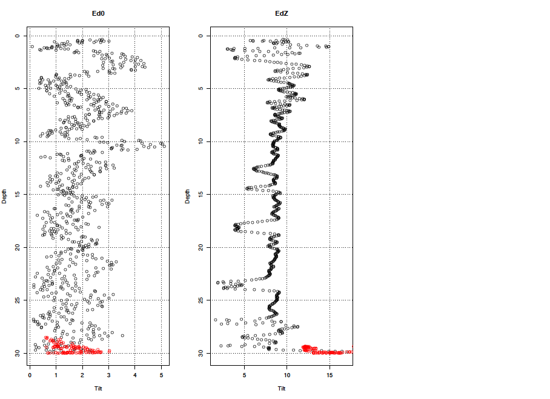
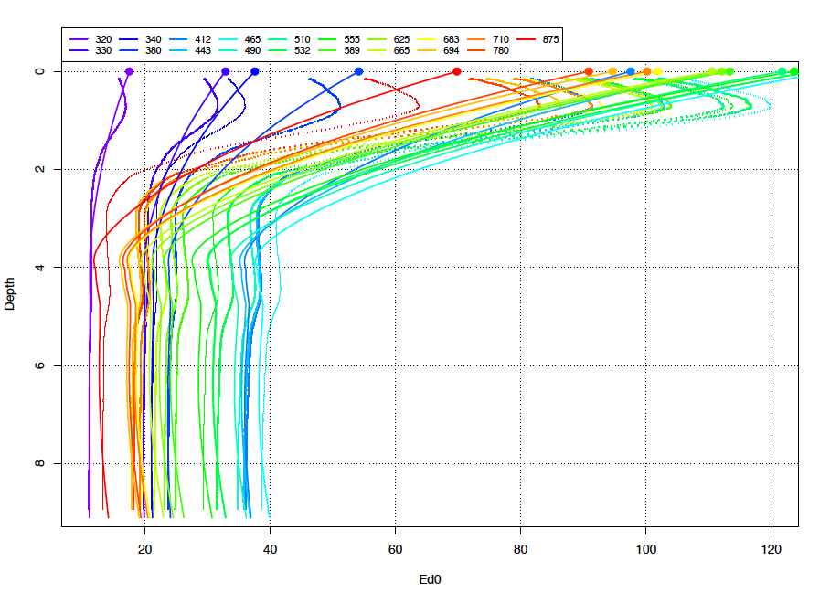

The Cops Package
================
Simon Bélanger
April 23, 2020

The Cops package was initially developped by Bernard Gentili at the
Laboratoire d’Océanologie de Villefranche (LOV). It gathers several
routines to process ras data collected using a C-OPS instrument. The
C-OPS is a Compact Optical Profilling System commercialized by
Biospherical instruments.

We have updated the package and implement new functions over time. This
is an ongoing work that requires collaborations. For that purpose, the
code was uploaded to GitHub by Simon Bélanger in November 2016.

Here I present some recommendations about data collection and
preparation at first, and then I will further explain how to use
the`Cops` package.

## Preliminaries

### Data collection and log book

In the field, we always document the deployement operations in a log
book Make sure you have this log book in hand before starting. This will
save you a lot a time. In fact, it is common that a bad profile was
recorded in the field for any reason. For example:

  - The reference sensor (Ed0) was shaded during the profile or the
    profiler went below the boat;
  - The profile was started too late and the top layer were missed;
  - The operator start a profile but the boat start to move, draggind
    the instrument at the surface while recording;
  - The acquisition was stated accidentally during the upcast;
  - etc.

Normally this kind of problem should be logged and the data can be
discarded before trying to process them. Usually, we don’t have time on
the boat to delete the data.

The log file should also provide insight about the profile quality. This
can really help when it is the time to quality control the data.

### Data preparation

We, at UQAR, have adopted a systematic way to store our raw data
collected in the field. Most of the time, field data are store in
different folders, often one folder per instrument or one folder for a
given date, etc. We store the raw data in a folder named **./L1/**. This
folder will be write protected to preserve your raw data. Processed data
will be then store in a folder name **./L2/**, where data are ornanized
in a more systematic way.

We stongly recommend to create **one folder per station**. The
recommended folder name contains the date and the Station ID such as:

**./L2/YYYYMMDD\_StationID/**

In this folder, you can then create one subfolder for each type of
measure (COPS, IOPs, ASD, SVC, PSR, etc.). Then you should copy your raw
data in their respective sub-folder. For example, supposed you have
visited the station P1 on the 6th of June 2015. You deployed the COPS
(three profiles) and one IOP package. So you will create one folder for
the station:

**./L2/20150606\_StationP1/**

Next you will create two subfolders for the COPS and IOPs, respectively:

**./L2/20150606\_StationP1/COPS/** and
**./L2/20150606\_StationP1/IOPs/**

It takes some time to organize at first, but it will make it easier to
retrieve your data in the future (even many years later\!\!).

## The C-OPS data processing

### Installation of the Cops package

As any other package available on GitHub, the installation is
straitforward using the `devtools` package utilities, i.e.:

``` r
devtools::install_github("belasi01/Cops")
```

This will install the binaries and all the dependencies, which can take
some times.

To install the full code sources, you can also “clone” the package in a
local folder. You have to create a “New project…” from the file menu and
choose the “Version Control” project type, and then choose “Git” option.
Next you have to indicate the full path of the R package repository on
GitHub, as illustrate
below.

<div class="figure">


<p class="caption">

Figure 1. Clone the package from GitHub to have a full access to source
code.

</p>

</div>

## Step 0 : Get stated with Cops processing and configuration of the INIT file

Unfortunately, most function of the `Cops` package does not have a help
page. This is because the user **only need to know one single function**
to launch the processing, i.e. the `cops.go()`. So let’s get
    started.

``` r
library(Cops)
```

    ## Loading required package: tcltk

    ## Loading required package: e1071

    ## Loading required package: stringr

    ## @@@@@@@@@@@@@@@@@@@@@@@@@@@@@@@@@@@@@@@@@@@@@@@@@@@@@@@@@@@@@@@@@@@@@@@@@@@@@@@@@@@
    ## TO BEGIN A PROCESSING AND PRODUCE WINDOWS PLOTS,
    ##     TYPE : cops.go(interactive = TRUE)
    ## TO BEGIN A PROCESSING AND PRODUCE   PDF   PLOTS,
    ##     TYPE : cops.go()
    ## TO BEGIN A PROCESSING AND PRODUCE   PDF   PLOTS, AND OUTPUT DATA IN ASCII FORMAT
    ##     TYPE : cops.go(ASCII=TRUE)
    ## TO BEGIN A PROCESSING AND PRODUCE   PDF   PLOTS, AND CLEAN THE PROFILE INTERACTIVELY
    ##     TYPE : cops.go(CLEAN.FILES=TRUE)
    ## @@@@@@@@@@@@@@@@@@@@@@@@@@@@@@@@@@@@@@@@@@@@@@@@@@@@@@@@@@@@@@@@@@@@@@@@@@@@@@@@@@@

As you can see, when you load the package with the `library()` function,
you got a message explaining how to launch the processing with the
different options proposed by `cops.go()`. By default, the options
**interactive, ASCII and CLEAN.FILES** are set to FALSE. I strongly
recommanded to first set the working directory (i.e. a folder where you
put the COPS data for a given station) using `setwd()` and than type
`cops.go()`. See what happen.

``` r
setwd("/data/ProjetX/L2/20500619_StationY1/cops")
cops.go()
```

You will get the following message:

**CREATE a file named directories.for.cops.dat in current directory
(where R is launched) and put in it the names of the directories where
data files can be found (one by line)**

In the present example, I will create a very simple ASCII file named
**directories.for.cops.dat** in my working directory in which I will put
the full path of the folder I want to process,

/data/ProjetX/L2/20500619\_StationY1/cops

One can process as many folders as wanted, but I don’t recommand that
when you process the COPS data for a given station for the first time.
In fact you need to quality control each vertical profile (one by one).
That being said, the batch processing is very useful when the code
change, which is expected as we constantly improve the `Cops` package.
So, after the QC all C-OPS profiles at the end of the processing, we
generally create a **directories.for.cops.dat** file, in the **./L2/**
folder, which contains all the station folder paths.

You can launch again the code.

``` r
cops.go()
```

This time you get the following message:

@@@@@@@@@@@@@@@@@@@@@@@@@@@@@@@@@@@@@@@@@@@@@@@@@@@@@@@@@@@@@@@
**PROCESSING DIRECTORY C:/data/ProjetX/L2/20500619\_StationY1/cops**
@@@@@@@@@@@@@@@@@@@@@@@@@@@@@@@@@@@@@@@@@@@@@@@@@@@@@@@@@@@@@@@

**EDIT file C:/data/ProjetX/L2/20500619\_StationY1/cops/init.cops.dat
and CUSTOMIZE IT**

As you can see, the program has created a file named **init.cops.dat**
in your working directory. This file contains several
informations/parameters that are required in the data processing, but
also for reading the data properly. In general, the parameters (or
global variable) found in the init.cops.dat file remain almost the same
for all stations.

### the **init.cops.data** file set up

You have to edit the following lines:

  - **instruments.optics;character;Ed0,EdZ,LuZ** : The
    *instruments.optics* variable is a vector of three character strings
    indicating which type of sensor was available on the current COPS
    configuration. The default is Ed0 (above water surface irradiance),
    EdZ (in-water downwelling irradiance) and LuZ (in-water upwelling
    radiance). Some systems may have EuZ (in-water upwelling irradiance)
    instead of LuZ. The `Cops` package version 3.2-5 and greater can
    process COPS systems having both LuZ and EuZ. In that case, all
    other fields must have 4 parameters instead of 3.
  - **tiltmax.optics;numeric; 10,5,5** : the *tiltmax.optics* is a
    numeric vector of three threshold values used to filter the data for
    the three sensors available in *instruments.optics*. Here the
    default (10,5,5) will eliminate every data collected when the Ed0
    instrument tilt was greater than 10 degrees and when EdZ or LuZ tilt
    were greater than 5 degrees, as recommended by NASA protocols. Note:
    in shallow waters or in case-2 water type having strong light
    attenuation, the tilt threshold ofter need to be relaxed in order to
    have enough measurements near the sea surface for a reliable
    extrapolation to the air-sea interface.  
  - **depth.interval.for.smoothing.optics;numeric; 10,4,4**: This
    parameter is used to smooth the data on a regular depth interval
    grid using a method known as LOESS (local polynomial regression
    fitting), which is a non-parametric method usually employed to
    smooth time-series (but here applied to light profile). LOESS
    computes polynomials on the data for a given window size that is
    moving along the profile. In the `Cops` package version 4.0 and
    later, the **filtering moving window** is defined in terms of
    meters. The larger the value, the smoother the fitted profile. These
    parameters (one by sensor) often need to be adjusted for a given
    profile. In shallow turbid waters for example, one should use values
    closer to 2 or 3 meters. NOTE: prior to version 4.0, we used a
    parameter called **time.interval.for.smoothing.optics**, which was
    based on a time-dependent window. If this parameter is provided, it
    will be converted into depth intervals
    (time.interval.for.smoothing.optics/profile.duration\*maximum depth
    of the profile).
  - **sub.surface.removed.layer.optics;numeric; 0, 0.1, 0** : This
    variable is use to exclude the data very close the air-sea
    interface. In fact, near-surface data may be very noisy due to wave
    focusing effect under clear sky. It is mostly important for EdZ. By
    default, we eliminate the first 10 cm (0.1 m) of the water column
    for EdZ, also because the sensor may exits the water a fraction of
    second when the profiler it at the surface.
  - **delta.capteur.optics;numeric; 0, -0.05, 0.238** : This variable a
    numeric vector of values indicating the physical distance between
    the pressure sensor and the actual radiometers. By default, we
    assume that the EdZ sensor is 5 cm above the pressure sensor (so
    minus 5 cm relative to the measured pressure), which is normally on
    the back of the LuZ sensor. The LuZ sensor length is about 23.8 cm
    below the pressure sensor (so we have to add 23.8 cm to get the
    depth of the LuZ measurement). This setup is quite standard and will
    not change unless you physically change the setup (e.g. depth
    pressure on EuZ is used instead of LuZ).
  - **radius.instrument.optics;numeric; 0.035, 0.035, 0.035** : This
    variable is a numeric vector of three values of instrument radius
    that will be used in the shadow correction. All sensor are 3.5 cm
    radius. (Note that this variable could be hard coded as it never
    change).

The next parameters are important for reading the data correctly. You
need to look into one CSV or TSV file to see how the data have been
recorded.

  - **format.date;character;%d/%m/%Y %H:%M:%S** : The *format.date*
    variable is a string indicating how the date and time are written in
    the file. This can change depending on the regional setting of the
    computer used to record the data on the field. The default assumes
    %d/%m/%Y %H:%M:%S but we often encountered %m/%d/%Y %H:%M:%S. You
    may need to read the help about `POSIXct` representing calendar
    dates and times format in R.  
  - **instruments.others;character;NA** : The *instruments.others*
    variable is single string indicating whether or not an other
    intrument is included in the COPS files. In the old COPS data
    acquisition (before 2014 or so), the data file included diagnostic
    information on the system (input voltage to instrument, temperature,
    etc.) in columns that were named Master+VariableName. So this
    variable was set to Master. Now these data are now stored in a
    separate file. So YOU WILL LIKELY have to keep NA (in capital
    letters) instead of Master if you’re working with recent COPS
    data.  
  - **depth.is.on;character;LuZ** : The *depth.is.on* variable inditace
    on which radiometer the pressure sensor is located. Default is LuZ
    but may be EuZ if you are using another set up (see above comments
    about *delta.capteur.optics*).  
  - **number.of.fields.before.date;numeric; 0** : The
    *number.of.fields.before.date* variable is a numeric value
    indicating the number of field present in the file name before the
    date. In fact, every COPS file are automatically named continaing
    the date and time of the acquisition (computer date/time when the
    file was created). Suppose you have a file named
    *06-261\_CAST\_004\_180813\_150418\_URC*, there are 3 fields
    separated by "\_" before the date. So here we would put 3 instead of
    0 (default value).

As mentioned above, the **init.cops.dat** file should not change much
from one station to another and can be copy/paste to every folder you
want to
process.

## Step 1 : Configure the **info.cops.dat** file and run the code for the first time to generate results

Once you are done with the **init.cops.dat** file, you can launch again
the code.

``` r
cops.go()
```

This time you get the following message:

@@@@@@@@@@@@@@@@@@@@@@@@@@@@@@@@@@@@@@@@@@@@@@@@@@@@@@@@@@@@@@@
**PROCESSING DIRECTORY C:/data/ProjetX/L2/20500619\_StationY1/cops**
@@@@@@@@@@@@@@@@@@@@@@@@@@@@@@@@@@@@@@@@@@@@@@@@@@@@@@@@@@@@@@@

**Read 17 items**

**EDIT file C:/data/ProjetX/L2/20500619\_StationY1/cops/info.cops.dat
and CUSTOMIZE IT this file must contain as much lines as
cops-experiments you want to process you will find a header with
instructions to fill this file**

Now if you look into the working directory, you will find a file named
**info.cops.dat**. This is another ASCII file you need to edit. As
mentioned above, the header of that file provides instruction on how to
arrange the information to process each C-OPS profiles you have in your
working directory. The header lines start with a “\#”. After the header,
you have to provide a line for each profile you want to process. Each
line will need to have 8 mandatory fields separated by “;”. The created
file already contains one line per file found in the working disrectory.
The first field is the file name. **IMPORTANT: you have to remove the
lines that are not corresponding to calibrated light profile file
(e.g. the init.cops.dat or the GPS file)**. Then you have to set the
processing parameters for each line.

  - The fields number 2 and 3 are the **longitude** and **latitude** in
    decimal degree, respectively. You have to provide them to allow the
    code to compute the sun position in the sky. This is mandatory. If
    your system was fitted with a BioGPS, you have to copy the GPS file
    in the working directory and put NA in fields 2 and 3. The code will
    retreive the position of the profile automatically. **IMPORTANT
    NOTE: Sometime you may get an error when reading the GPS file. This
    is because a header line may be found in the middle of the file.
    This is because only one GPS file is created per day. If the file
    exists when restarting the COPS, it will happen the data at the end
    of the existing file. You have to clean the GPS file by removing
    header lines manually (except the first line of the file).**

  - The field number 4 is for the **shadow correction** method to use
    for calculating the water-leaving radiance and the reflectance (999,
    NA, 0 or a decimal value). The instrument shadow effect has been
    described in Gordon and Ding (1992) and Zibordi and Ferrari (1995).
    The correction they proposed requires the total spectral absorption
    coefficients of the surface water. There is four options:
    
      - NA -\> no correction is applied;
      - 0 -\> you have to provide the absorption coefficients for all
        wavelengths in a file called **absorption.cops.dat**;
      - if a decimal value is provided -\> the code will assume it as
        the chlorophyll-a concentration and estimate empirically the
        absorption value using a Case-1 water bio-optical model (Morel
        and Maritorena 2001);
      - 999 -\> the total absorption coefficient is estimated from the
        diffuse attenuation coefficient, *K\_d*, and the sub-surface
        irradiance refletance, *R*, which are estimated using the
        downwelling irradiance profile, *E\_d*. The equation 8’ of Morel
        and Maritorena (2001) is used to estimate the absorption
        coefficient. The diffuse attenation is calulated using a linear
        for the log-transformed data near the sea surface (or the loess
        fit is used if the linear fit failed).

  - The field number 5 is the **time window**, which is the number of
    seconds after the start of the recording corresponding to the actual
    begining and the end of the cast, respectively. This is eventually
    avoid if the file have been cleaned prior the processing. This can
    be achieve using the CLEAN.FILES option.

When you process the data for the first time, the fields 4 to 8 can be
leave as is. The processing will take the default values found in
**init.cops.dat** for fields 6, 7 and 8. The later fields were described
above and they stand for *sub.surface.removed.layer*, *tiltmax.optics*,
and *depth.interval.for.smoothing*. All of them contains 3 (or 4) values
separated with “,” for each sensors.

You can launch again the code.

``` r
cops.go()
```

Normally the code will run without errors, except if the data is not
good (a very bad profile that was recorded by error on the field) or if
you have made a mistake in the **init.cops.dat** file (e.g. often you
did not changed Master to NA for field *instruments.others*, or you made
a mistake in the date/time format, etc.) or if the data file was
recorded specifically for the Bioshade
measurements.

## Step 2: Preliminary analysis of the results output and processing parameters adjustment

First of all, when the code is run without error, it creates two (or
three) new directories (BIN/, PDF/, and optionnaly ASC/) in the working
directory as well as two ASCII files names **absorption.cops.dat** and
**select.cops.dat** (version prior 4.0 generated a file named
**remove.cops.dat**). The former is the file you have to edit if you
want to correct for instrument self-shaddow effect (see above) using
measured absorption coefficients (one line per profile).

### The **select.cops.dat** file

The **select.cops.dat** file lists the same file names found in
**info.cops.dat** follow by three parameters separated by semi-columns.
The second column is an integer (0,1,2 or 3) indicating the type of
C-OPS cast. By default, all file are set to 1, which consider a normal
light profile. To remove profile, we change the integer to 0. Other
C-OPS cast are Bioshade (2) or under-ice profile (3). In case of an
under-ice profile, no extrapolation to the air-sea interface is
performed and sub-surface AOP (nLw, Lw, Rrs, etc) are not calculated.
The columns 3 and 4 are specifying the best extrapolation methods for
the remote sensing reflectance (Rrs) calculation and for Kd (not
implement yet). Therefore the third column will accept **Rrs.0p.linear**
or **Rrs.0p** for linear and loess extrapolation, respectively.

Let’s focus now on the PDF/ directory in which one PDF per profile was
generated. You will have to open each PDF and analyse the results to
adjust the processing parameters.

### Step 2.1 : Clean the files

The second page of the PDF document shows the depth of the profiler
versus time, in seconds, since the begining of the recording (Figure 2).
The title of the plot provides the date/time, the duration of the cast,
the position and the sun zenith angle. Check this information if it is
correct and in particular the sun zenith angle, which has been
calculated from the position and the UTC time. In that example the cast
duration was 26 seconds. The profiler was at 1 m from the surface right
at the begining, then reach the surface after 3 seconds, and drop the
bottom at 18:18:58 UTC, i.e. about 22 seconds from the begining. **Such
a profile MUST be clean**. In fact, the profiler should in free-fall to
pass the linear fit
conditions.  

<div class="figure">


<p class="caption">

Figure 2. Example of pressure or depth of the profiler versus time in
second since the begining of the recording

</p>

</div>

With the version 4.0, you can clean the file by runing the code again,
but with the **CLEAN.FILES** option set to **TRUE**. Note that this step
can be avoid if the data were already cleaned using the Shiny App
developped by Guislain Bécu. This application can be downloaded from
<https://github.com/GuislainBecu/01.COPS.CLEAN.INPUT.FILES>

``` r
cops.go(CLEAN.FILES = TRUE)
```

The user will be prompt to click on plot of depth versus index to
determine the begining of the cast and the end of the cast (Figure
3).

<div class="figure">


<p class="caption">

Figure 3. Example of depth of the profiler versus the number of records
(index) available in the file

</p>

</div>

Here the user click on the index 46 for the starting point and the index
352 for the ending point. In this example, the profiler hit the bottom,
as the depth become constant to 5.5 m from the index 352 to the end of
the cast. **IMPORTANT NOTE: To avoid bad data near the bottom, the
profile will be cut 15 cm abobe the ending point set by the user.** This
procesing greatly improve the results in shallow waters, allowing easier
extraction of the bottom reflectance property.

Figures 4 and 5 show the depth vs duration and the instrument tilt
during the cast, respectively. Here the tilt of both Ed0 and EdZ
instruments was below the threshold, exept for a few points near the
surface. In difficult conditions, i.e. due to strong current or wind,
too much tension in the cable, the C-OPS tilt may be high. The Figure 6
shows an extreme case we encountered in the Labrador Sea in 2014.
Keeping the tilt threshold at 5 degrees the for the in-water sensors
would have removed nearly all the data\! In such case we need to
increased the threshold to 10 degrees to get AOPs, which acceptable in
the open ocean when the profiler is far from the
ship.

<div class="figure">


<p class="caption">

Figure 4. Example of pressure or depth of the profiler versus time in
second since the begining of the recording after cleaning the
file.

</p>

</div>

<div class="figure">


<p class="caption">

Figure 5. Example of instrument tilt for Ed0 and EdZ (i.e. the profiler)
during the cast. Red points have been discarded for the rest of the
analysis using the tiltmax.optics
parameter.

</p>

</div>

<div class="figure">



<p class="caption">

Figure 6. Example of instrument tilt for Ed0 and EdZ (i.e. the profiler)
during the VITALS cruise in 2014 onboard the Hudson. Note that the
figure was generated by the version 3 of the Cops
package.

</p>

</div>

### Step 2.2 : Check the dowelling irradiance conditions during the cast.

Downwelling irradiance above water (Ed0) must be stable during the C-OPS
vertical profile. Cloudy sky can make it highly variable. Some shadow on
the instrument from the ship structure a person near by (on small boat
sometime) can be a problem as well. Big change in Ed0 will likely
results in a bad light profile because LuZ and EdZ are normalized by the
Ed0 variability (see NASA protocols). In the example shown in Figure 7,
Ed0 was very stable. The variability was due to tilt of the instrument
probably resulting from a moving boat by waves. The LOESS smoothing
completely remove these artefacts. In this example, the conditions were
perfect.

<div class="figure">


<p class="caption">

Figure 7. Example of stable Ed0 conditions during a vertical profile

</p>

</div>

The next example (Fig. 8) shows a drastic drop in Ed0 during a profile.
This kind of unstable conditions is bad for the rest of the data
processing. This profile should be discarded by changing the value of 1
to 0 in the file
**select.cops.dat**.

<div class="figure">



<p class="caption">

Example of an unstable Ed0 conditions during a vertical profile

</p>

</div>

# References

<div id="refs" class="references">

<div id="ref-Gordon1992b">

Gordon, H R, and Kuiyuan Ding. 1992. “Self-shading of in-water optical
instruments.” *Limnology and Oceanography* 37 (3): 491–500.

</div>

<div id="ref-Morel2001">

Morel, André, and Stephane Maritorena. 2001. “Bio-optical properties of
oceanic waters: A reappraisal.” *J. Geophys. Res.* 106 (C4): 7163–80.

</div>

<div id="ref-Zibordi1995">

Zibordi, G, and G M Ferrari. 1995. “Instrument Self-Shading in
Underwater Optical Measurements - Experimental-Data.” *Applied Optics*
34 (15): 2750–4.

</div>

</div>
